<div align="center">

# 🧱 BRICKBLADE

### *Smash the waves. Grab the studs. Everything falls apart.*

**A brick-built action RPG that lives in a single HTML file.**

No build step. No bundler. No `node_modules`. Double-click it.

<br>

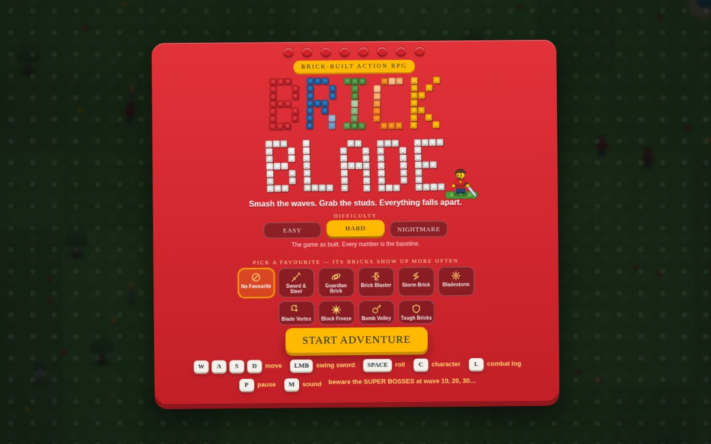

<br>

`83 bricks` · `41 monsters` · `8 bosses` · `13 builds` · `50 waves` · `1 file`

</div>

---

## Contents

**Start here** — [Play it](#play-it) · [The loop](#the-loop) · [What's in the box](#whats-in-the-box) · [Controls](#controls)

**The kit** — [Weapons](#weapons) · [Elements & ailments](#elements--ailments)

**Your build** — [The damage model](#the-damage-model-is-path-of-exiles) · [Rarity](#rarity) · [The combination panel](#the-combination-panel) · [Reading your own build](#reading-your-own-build)

**The world** — [Monsters](#monsters) · [Bosses](#the-boss-ladder) · [Drops](#drops) · [Difficulty](#difficulty) · [The world gets colder](#the-world-gets-colder)

**Reference** — [Every buff and debuff](#every-buff-and-debuff) · [Every cap](#every-cap) · [Under the hood](#under-the-hood)

**Between runs** — [The skill tree](#the-skill-tree) · [design notes](docs/PROGRESSION.md)

---

## Play it

```bash
git clone https://github.com/bjorn-karlsson/lego-survival.git
# then open lego-survival/lego-survival.html — double-click it, or drag it onto a browser
```

That is the whole install. One 500 KB HTML file with a single `<script>` in it. The only
thing it reaches for over the network is a Google Fonts stylesheet — block it and the game
runs exactly the same in fallback type.

---

## The loop

You are a minifig in a field of studs. Waves of brick monsters walk at you and come apart
when hit. Each run introduces the roster in a different order — banded by era, so the
opening wave is a coin-toss between four monsters and never a wave-30 horror. Every wave,
every level and every chest hands you a **brick** — one of 83 upgrades — and the bricks
compound into a build. Waves open with a breather so you can heal and read what you took,
and <kbd>F</kbd> skips it. Survive long enough and the ground is a carpet of studs, the
screen is a storm of lightning, and a three-storey skeleton is throwing its own ribcage
at you.

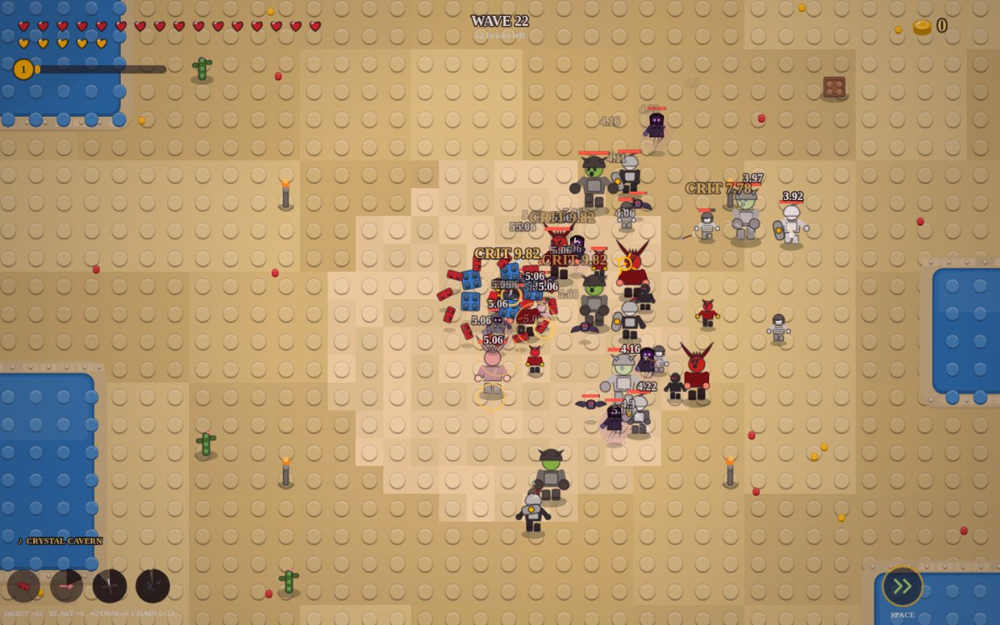

---

## What's in the box

<table>
<tr><td width="33%" valign="top">

### ⚔️ Four spells, your pick

**A run may cast four spells and no more.** Once you have four, the bricks that would hand
you a fifth stop being offered and everything that deepens the four you have keeps coming.

`Guardian Brick` · `Storm Brick`
`Bladestorm` · `Blade Vortex`
`Block Freeze` · `Bomb Volley`
**`Brickbane`**

Pick a **favourite** at the menu — including `Sword & Steel` or `Tough Bricks`, which spend
no slot at all — and its bricks turn up more often, plus a starting kit to match. The panels
either side of the title box show [what the pairing actually opens
with](#the-combination-panel).

`Runic Tempo` is the one brick that speeds up **all four at once** — see
[ability floors](#ability-floors).

</td><td width="33%" valign="top">

### 🗡️ Pick a weapon

`SWORD` · `AXE` · `MACE` · `STAFF` · **`BOW`** · **`SCEPTER`**

Your weapon is a **table row**, not a special case in the code — base damage, swing time,
reach, crit, bleed, and what it is worth defensively. The art follows it: you hold what you
picked, you swing it, and your spells throw it.

The **staff does not swing at all**. It casts fireballs, and it trades the whole melee kit
for the elemental one. The **bow** does not swing either: it looses arrows, and one legendary a
run makes them [Lightning, Fire or Chaos Arrow](#the-bow). The **scepter** hits nothing at
all — it [raises the dead](#the-scepter) and they fight for you.

Full numbers in [**Weapons**](#weapons), and hover one on the title screen for the live
comparison against the sword.

### 🪓 Each weapon swings its own way

The sword sweeps twice and spins; the **axe chops and then backswings**; the mace does not swing
at all, it slams; the staff casts. A combo is a row in a table, and **Blademaster — the whirl —
is offered only to a weapon whose combo has a spin in it to hold down**, which is read off that
table rather than off a list of weapon names. The axe has its own rhythm and its own legendary
to go with it.

Each swinging weapon also has its own opening hand: **Sword & Steel** for the sword (flat
damage, swing rate, reach), **Reaver's Edge** for the axe (critical chance, critical damage, a
deeper Momentum), **Earthshaker** for the mace.

### 🩸 Elements & ailments

Fire, frost and lightning all stack, on you and on them, and **the fifth stack breaks
something** — you freeze, they turn BURNT, everything you own hits a shocked body harder.

**Five stacks is a threshold for all three.** Fire brands **BURNT** (+25% MORE fire, ×4),
lightning brands **SHOCKED** (+7% MORE of *everything*, ×3) and frost brands **BRITTLE**
(−12% frost resistance, ×4). Shock never had a brand at all: five stacks was the end of the
line and every further bolt did nothing. Unlike a fire — whose stacks are *fuel* — a shock
brand does **not** spend the stacks, because shock's stacks **are** the multiplier and
spending them would drop a fully shocked body back to nothing the moment your fifth bolt
landed. Stacks and marks are separate MORE multipliers on the body, so a fully shocked,
fully branded monster takes **×1.65** from everything.

**Every ailment lasts longer.** Four seconds was short enough that a stack laid by one source
had usually expired before a second source arrived — which is the whole reason to own two.
Chill and shock **4s → 7s**, burning **6s → 9s**, BURNT **10s → 16s**, bleed **8s → 11s**,
poison **5s → 8s**.

**Poison drains; it does not drip.** Half a second between bites meant a poisoned body's
health bar came down in visible steps with a number over each one, which reads as a series of
little hits rather than as rot. It comes off **thirty times a second** now, silently — no
number, no flash, no shove, just a bar that slides and green coming off the body. The rate is
unchanged; only the grain is. And it drains by *elapsed time*, not by a fixed slice, so a slow
frame takes exactly as much as three fast ones.

Curses, poison and bleed run alongside on their own pools. See
[**Elements & ailments**](#elements--ailments).

</td><td width="33%" valign="top">

### 👑 Bosses every five waves

Five named bosses rotate through waves 5, 15, 25…

Every **tenth** wave is an ULTRA: `OMEGA BRICKTHANE`, `MEGA BONE BARON`, `ULTRA LAVABRICK`
— each with its own signature (nova, bone spiral, meteor), a health bar across the top of
the screen, and a guaranteed chest.

**Wave 50 is the grand raid**, and every boss in the game wakes up at once.

In a hurry? **Hold F mid-fight** to call the next wave down early and fight both at once.

</td></tr>
</table>

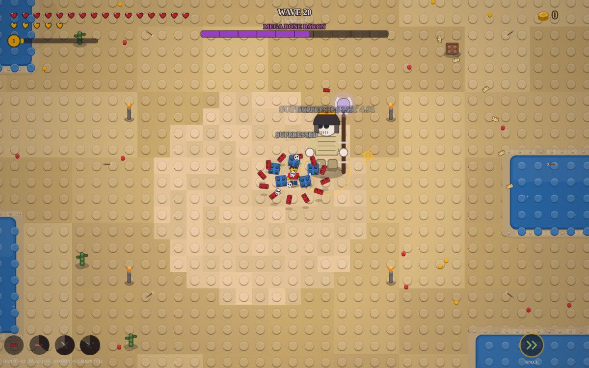

---

## Weapons

Your weapon is a **table row**, not a special case in the code. It sets the physical side
of the hero — base damage, swing time, reach, how often and how hard it crits, and how
readily a hit opens a wound — and every brick you own scales it from there.

**What it hits for**

| | base | attack | reach | crit | crit mult | bleed | spin |
|---|--:|--:|--:|--:|--:|--:|--:|
| **SWORD** | 1.00 | 0.34s | 56 | 5% | ×1.50 | ×1.0 | ×1.40 |
| **AXE** | 1.15 | 0.40s | 54 | **10%** | **×2.10** | ×0.45 | ×1.55 |
| **MACE** | **1.70** | 0.54s | *slam* | 3% | ×1.20 | **×1.90** | — |
| **STAFF** | 1.70 | 0.68s | *bolt* | 6% | ×1.60 | — | — |
| **BOW** | 1.25 | 0.60s | *arrow* | 7% | ×1.65 | ×0.8 | — |
| **SCEPTER** | 2.10 | 0.70s | *raise* | 5% | ×1.50 | — | — |

**Four of the six do not swing at all.** The staff casts a fireball; the mace opens a
**ground slam**; the bow looses an [arrow](#the-bow); the scepter [raises skeletons](#the-scepter)
(its 2.10 is the base of every skeleton's hit, and 0.70s is one raising). Both trade the whole melee kit — reach, the spin combo, the whirl — for an
attack of their own, and both are offered the sword's bricks no more than a staff is
offered the axe's.

**What it keeps you alive with**

| | less damage taken | spell suppression | lifesteal | resistance |
|---|--:|--:|--:|--:|
| **SWORD** | 40% | 25% | 15% of swings, for 6.0% | — |
| **AXE** | 45% | 25% | **20% of swings, for 9.0%** | — |
| **MACE** | **60%** | **30%** | 10% of swings, for 3.5% | — |
| **STAFF** | — | — | — | **+8% to all three** |
| **BOW** | — | 10% | — | — · **+120 evasion** |
| **SCEPTER** | — | 15% | — | — |

An axe crits twice as often for twice as much, but a clean cut barely bleeds. A mace hits
hardest and opens the worst wounds — 95% bleed on a critical against the sword's 50% — and
is slow and crits rarely.

The axe is **double-bitted** — a crescent to either side of the haft, edges facing opposite
ways — and the hero shoulders it on a lean rather than dead upright, because straight up
buries the inner bit behind the minifig's head.

**Melee is armoured by the fact that it has to be there.** A staff never has to stand where
the monsters are; a sword does, and the numbers were written as if it did not. So the three
melee rows carry their own defence, the mirror of the cast speed the staff gets for standing
back:

- **Less damage taken** — 40 / 45 / **60%**. It is a LESS multiplier applied *last*, after
  armour and after suppression, so it takes its share of whatever got through rather than
  competing with armour for the same pool. It reaches poison, bleed and burn as readily as
  it reaches a hit.
- **Spell suppression** — +25%, or **+30%** on a mace, on top of whatever you have bought.
- **Lifesteal** — see below.

The mace is the one that never leaves contact, so it carries the most of both.

**The staff gets +8% to every resistance** instead. It stands in the fire it starts, and it
is the one weapon that cannot answer a burning floor by walking out of it.

### 🪓 The backswing — *what an axe swing is*

The axe used to run the sword's three-step combo with different numbers. It swings **twice**
now:

| | | |
|---|--:|---|
| **the chop** | 0.20s | forward, ordinary reach |
| **the backswing** | 0.33s | **270°** out of the chop and all the way round behind you, at spin reach, and **always a critical on the first body it touches** |

*tap-TAP* instead of *tap-tap-TAP* — and the guaranteed critical is what **Reaving** is waiting
for, so the rhythm of the weapon and its legendary are the same thing. Only the *first* body:
a 270° sweep that crit everything in it would be a legendary, not a combo step.

A weapon's combo is a row in a table, so a fifth weapon swings differently by being written
down rather than by adding a branch.

### ⚡ Momentum — *and stacks in general*

**Every swing that connects builds a stack.** Six at most, each worth **+8% attack speed and
+4% reach**, and one falls off every **2 seconds** you go without adding another. Once per
swing however many bodies are in the arc — one step into a crowd being the whole ramp would
make it a formality. At six stacks the axe swings **48% faster** and reaches a third further.

It bleeds, it does not drop. Losing six stacks the instant you miss is a cliff, and a cliff is
a thing you *avoid* rather than a thing you play with; bleeding one at a time means dropping
out of a fight costs the ramp gradually and a single miss costs almost nothing.

**The system underneath knows nothing about momentum.** `HERO_STACKS` is a table of named,
self-expiring counters — a cap, a decay, a list of what one stack is *worth*, and optionally
which weapons may carry it. Whoever cares reads `stackMod('atk')` and never learns which stacks
exist. **Rage** is the second row in that table, and it needed one new field.

### 🔴 Rage

> **You gain more attack damage. You lose 10 rage every second if you have not been hit or
> gained rage in the past 2 seconds.**

That sentence is `grace: 2` and `rate: 10` in the table and nothing else anywhere. It is the
*other* decay shape: momentum falls off one at a time, rage sits still for a grace and then
pours away.

**Nothing gains rage by default.** The ceiling is **30** and the generation is **nothing** — a
hero buys it and a monster is given it, which is what makes it a build rather than something
that happens to everybody. Every point is **+1% MORE attack damage**, so a full well is ×1.30
on what you swing, and on nothing you cast: rage is the melee build's own ramp.

| | |
|---|---|
| **Warpath** / **Spite** | bricks: your swings, or the hits you take, build rage |
| **Deep Well** | +4 to +16 maximum rage, offered once you generate any |
| **WARPATH**, **SPITE**, **THE DEEP WELL** | three groups in the red country, at +0.2 a hit |
| **The Red Mist** | the notable at the far end: +5 maximum and generation both ways |

**And a monster can carry it.** The `WRATHFUL` wave modifier turns it on: hurt something and it
gets angrier, up to +30% damage, and it cools off if you leave it alone. Same table, same
decay, same tick — the only thing the monster side needed was for the stack helpers to take an
entity instead of assuming the hero.

Rage is fractional, because you gain a fifth of a point at a time. It is drawn as a bar with a
number rather than as chevrons: thirty chevrons is a fence.

Every live stack is a chevron over your own head, in its own colour, and the one about to fall
off fades as its clock runs down — a ramp you cannot see is a ramp you cannot play around.

### 🪓 Reaving — *what the axe does that nothing else can*

Every other weapon had a legendary that changed what it **is** — the sword whirls, the mace
slams the elements, the staff scatters embers. The axe borrowed the sword's.

The axe's identity is in two numbers: **twice a sword's crit chance and a far bigger
multiplier**, paid for with a bleed multiplier of **0.45** that locks it out of the one tree its
crits would otherwise feed. So the payoff for critting *is* the mechanic.

> **Reaving** — *legendary, axe only.* Every **critical** hurls a spinning axe. It reaps
> through up to **3** more bodies within 320px, each for **70%** of the critical that threw it
> and each able to crit on its own. **You keep swinging**, and up to **4** can be in the air at
> once — **6** at rank two.

**You keep the axe.** The first cut of this left the hero standing there empty-handed until the
blade came home, which read as a punishment for critting on a build whose whole idea is
critting: stack attack speed, crit more, swing less. What flies is a *copy*. A second critical
throws a second one, and several axes in the air at once is the good version of this legendary,
not a bug to design around.

What holds it in check is two numbers instead of your hands: a **0.16s** cooldown between
throws, so forty criticals landing in one frame still throw one axe, and a hard ceiling on how
many may be out. A **bounce** can still never start a blade of its own — several axes have to
come from several *criticals*.

> **Rank two** — the blade leaves a **BLEEDING** body for free. Reaping one costs it none of its
> three bounces, so a wound is a longer harvest — and the axe's own terrible 45% bleed becomes
> the thing you build around.

Measured: rank one reaps 4 bodies off a ring of nine; rank two over the same ring, bleeding,
reaps all 9.

### ⛰️ The ground slam — *what a mace does instead*

A mace hero does not swing. They drive the head into the floor and a **fault** opens in
front of them: lines of stone teeth tearing up out of the ground in a fan, running outward
from the impact. It is the boss slam you have been dodging all run, pointed the other way.

Every tooth is **physical** — it bleeds, it leeches, and it reads every increase a swing
would. It **takes the scenery with it** too: chests, crates and trees inside the fault take
one hit per slam, the same as one swing would, so a wide fault opens every crate it crosses.
It does **not** deflect — a slam is the floor coming up, and nothing about that turns an
arrow aside.

**What it is worth.** Each tooth is **36% of a full swing**, and **one body may be bitten
by at most three teeth of the same slam** — so a body held dead centre in the fault takes
**1.08 of one mace swing** per slam, and everything else in the fan takes the same.

This number has moved twice. It opened at **0.62** a tooth, which made an AoE basic attack
beat the single-target one it replaced. The cut to **0.307** fixed that and overshot: the mace
came out at **4.37**/s against the sword's 5.79 and the axe's 6.28 — a quarter behind on one
body while *also* being the slowest weapon in the game. It was not trading single-target for
coverage, it was paying twice for it. At **0.36** the mace sits at **5.12**/s: still under the
sword on one body, which is what the fan is for, but no longer the weakest thing you can pick
up.

Read off a fresh hero with no favourite, which is what the character sheet's
**Sustained DPS** row shows you:

| | single target | |
|---|--:|---|
| **SWORD** | **5.79** /s | one body, kept in reach |
| **AXE** | **6.28** /s | one body, kept in reach |
| **MACE** | **5.12** /s | one body held in the fault — *and everything else in it* |

About **88%** of a sword's single target, spread across everything in a 99° fan. That is the
trade — and the test asserts the ratio, not the literal, so the day the numbers move it is
still the rule that is being checked.

**You can see through your own teeth.** A fully-fanned slam is twenty-six rows of stone
standing between you and the pack you are standing in, and at full opacity the thing you needed
to read — what is walking at you — was behind the effect you cast to deal with it. Your teeth
are drawn at **52%**. The *monsters'* are not: a hazard you have to see is a hazard.

| | opens at | ceiling |
|---|--:|--:|
| **Fault width** | 99° | **180°** — or a full **360°** ring |
| **Fault reach** | 200 px | **430 px** |
| **Fault speed** | 620 px/s | **1400 px/s** |

Speed is a real stat, not decoration: a slow fault means the far teeth arrive *after* the
pack has walked off them. And a wider fault throws **more** teeth rather than the same
teeth further apart — the fan never thins as it opens.

Four bricks and a legendary, offered to nobody else:

| | |
|---|---|
| **Fault Hammer** | +FLAT damage to every tooth |
| **Wider Fault** | the fan opens wider |
| **Deep Fault** | increased range |
| **Fault Line** | increased speed |
| 🟧 **Slam of the Elements** | below |

**🟧 SLAM OF THE ELEMENTS.** Every slam takes the next element in turn — 🔥 fire, ⚡
lightning, ❄️ frost — and converts **half of every tooth** into it. The converted half pays
the monster's resistance and leaves that element's ailment behind: **burning**, **shock**,
**chill**. The physical half is untouched, so the slam still opens wounds while it does it.
The stone comes up in that element's colour, with a seam of it running up each tooth, so
which one is loaded is something you read off the floor rather than off a counter.

**Taken twice, the fault closes into a ring.** The 180° ceiling lifts to a full **360°**
and the stone comes up all around you.

`Earthshaker` is its favourite, and it is not offered to a weapon that swings — the same
way `Sword & Steel` is no longer offered to one that does not.

### 🩸 Lifesteal

Every swing has a **chance** to drink a **share** of the physical damage it just landed. Both
halves are stats, both can be bought, and the axe drinks most:

| | chance to drink | share of the hit | average per swing |
|---|--:|--:|--:|
| **AXE** | 20% | 9.0% | **1.80%** |
| **SWORD** | 15% | 6.0% | 0.90% |
| **MACE** | 10% | 3.5% | 0.35% |

- **Vampiric Edge** raises the share, to a ceiling of **25%**.
- **Thirsting Grip** raises the chance, to a ceiling of **60%**.

It leeches off what **actually landed** — after armour, after resistance — so a swing that
barely got through barely heals. Only your own swing and the whirl it becomes drink; a spell
that happens to deal physical damage does not, and neither does a bleed tick.

And no single swing may return more than **3% of your maximum hearts**, which is the cap
that matters: a share of a wave-50 crit is otherwise an entire health bar. A staff never
drinks at all.

**The staff does not swing at all.** It is the first *caster* weapon: its basic attack is a
**fireball** that bursts for 46 and sets what it touches alight. It gives up the entire melee
kit — reach, the spin combo, bleed — and gets **+25% increased spell damage, +30% increased
elemental damage and +20% increased cast speed** for carrying it. Physical bricks are not
offered to a staff hero at all; the elemental ones are not offered to anyone else.

**Fire burns.** Every bolt lays a stack that ticks for 30% of the hit a second over 9s, and
they all burn at once. **Five stacks is a threshold, not a counter.** From there, every fire
that lands has a **30% chance** to brand the body **BURNT** — **+5% per stack above five**,
so a deeper fire brands sooner — and branding costs **five stacks, not the whole fire**.
A BURNT body takes **25% MORE fire**; marks stack to four, each its own multiplier, so a
four-mark body takes **×2.44**. Burning is damage over time, so it reads the same `Rotbrick`
pool poison and bleed do.

> This used to fire on the stack that **overflowed the cap**, which made `Ember Scatter` —
> whose whole job is to deepen the well to 10 stacks and then 20 — quietly a *downgrade* for
> the thing it fed: at rank 2 you needed **21 fires** to see a single mark, and the brand
> then threw **19 of your 20 stacks away**. Five is the threshold at every depth now, and a
> brand costs five.

Five bricks come with it: `Ember Core` (flat elemental), `Elemental Focus` (increased
elemental), `Pyromancy` (increased fire), `Wildfire` (a wider burst), and the legendary
**`Ember Scatter`**.

**Ember Scatter** is the fireball's payoff. Hitting a body that is **already burning**
knocks **2 embers** off it — **5** once upgraded — and each one sets another monster alight
for 45% of the hit that threw it. With nothing in reach they **loop back** into the body
that threw them, so it is never dead weight against a boss on its own. It also deepens the
well: fire piles **10 stacks** instead of five, **20** upgraded, so BURNT comes round rarer
but the burn underneath it is four times the size.

**An ember goes looking for something that is not on fire.** Nearest-first meant a chain
reaction fed itself: in a packed crowd every ember piled onto whatever was closest, which
was almost always a body already alight. The preference is one comparison, expressed in
**pixels of detour an ember will fly**:

| | cost |
|---|--:|
| distance to the body | 1 px per px |
| the body is **already burning** | **+460** — so an unburnt body most of the way across the seek radius still beats a burning one at your feet |
| each ember **already sent** to that body this volley | **+240** — so a volley of five lights five bodies, not five-times-one |
| further than **520 px** | not considered at all — an ember never crosses the map for fresh meat |

A burning body is still a target when it is the only thing standing, so an ember is never
wasted; and the mid-flight retarget asks the same question, so an ember that outlives its
mark does not fall back to nearest-only halfway there.

They no longer leave in an even fan, either. Evenly spaced spokes plus a nudge read as a
machine part firing; embers now come off in **any direction, at any speed between 28% and
95%**, and hang in the air for **different lengths of time** before they start hunting.

A chain travels **3 bodies deep** and one body can only throw embers every 0.25s, so a
packed crowd lights up and then settles rather than running away.

**`Block Freeze` is the staff's second element.** It deals **frost damage** and lays a
**chill stack** — each one drags a body 13% slower, and **the fifth freezes it solid**.

It used to be a wall of frost that arrived rarely, reached most of the screen and dropped
its whole hit in one lump. It is now a **short, frequent pulse**: the opening interval went
**10s → 5.5s** (floor 3.5s → 2.2s), the reach **190 → 128** (cap 420 → 290) and the base hit
**1.6 → 0.85**. Something you feel every few seconds rather than a bomb you wait for.

**And the ring is the spell.** The frost animation expanded at a fixed 420 px/s for a fixed
half-second, which reaches the edge at exactly one radius and misses at every other — a
small pulse drew a ring **three times** the size of the spell, and a maxed one fell **60 px
short** of what it was freezing. Speed is derived *from* the radius now, so the frost always
arrives at the edge, and always at the same moment.

**Frozen leaves a body BRITTLE.** The fifth chill stack still freezes a monster solid — and
now leaves a mark that takes **12% frost resistance off it**, four marks deep. The mark lands
on a **boss** too: a boss cannot be held still, but it can be made easy to freeze, which is
the first thing frost has ever done to one that lasts.

**Every stack of the spell deepens the CHILL, and chill has a ceiling.** Extra stacks used
to buy radius and duration with **no cap on either**: forty-six of them read **1654 px** and
**63 seconds** on the test bench, which is not a spell, it is an oversight. They lay an extra
chill stack now instead, capped at **4** — five freezes a body solid, so one pulse can never
do it alone however you got there. The card stops being offered once it can buy nothing more,
and it prints its own ceiling, so it can never promise a stack it will not hand over.

**It has its own rarity ladder, and it starts at RARE.** Every other spell counts in
projectiles and can afford eight of them; this one counts in chill stacks, so an *uncommon*
handing over two was three quarters of a permanent freeze on one card. A **rare gives +1**,
an **epic +2**, and it is never offered below rare.

| | |
|---|---|
| **`Killing Frost`** | flat frost damage, added to the base *before* every increase |
| **`Absolute Zero`** | every caught foe frozen SOLID for 4.5s **and left BRITTLE** — and anything that **dies frozen SHATTERS**, throwing your own pulse out of the corpse |

`Deepening Winter` is gone: it did the job the spell's own stacks now do, which made picking
the spell up twice and picking it up once the same card in two coats.

**A frozen corpse throws your pulse.** Absolute Zero's payoff is no longer just a stun — a
body that dies frozen shatters for **75% of your own radius**, with the same frost and the
same chill, and what it died **BRITTLE** with is the multiplier: **+50% a mark, four deep**,
so a four-mark corpse hits for **2×** a one-mark corpse. A shatter that kills sets off
another, twice deep and no further. The frost build's own debuff is what makes its kills
worth watching.

The freeze also **holds longer** — the chill 2.5s → **4.5s**, and Absolute Zero 3.0s →
**4.5s** — because a pulse this small and this frequent has to make what it lands stick.

It is only offered to a caster, the way the melee spells are only offered to a melee weapon.

**Nothing is offered to a weapon that cannot use it — and the card says so.** Every brick
whose requirement is narrower than "any weapon" prints the weapons it serves in a small row
under its text, read straight off its own gate so the label can never drift from the rule.

A staff hero is never shown `Sharpened Blade`, `Longsword`, `Blade Mastery`, the legendary
`Blademaster`, the bleed bricks, or **either blade spell and its whole tree** — Bladestorm
and Blade Vortex are for a hero who carries a blade. A melee hero is never shown the frost
tree or the elemental one. The favourites gate the same way: `Sword & Steel`, `Bladestorm`
and `Blade Vortex` do not appear for a caster, and the new **`Elemental Arts`** and
`Block Freeze` favourites do not appear for a melee weapon.

**Bladestorm and Blade Vortex stay physical** and open wounds on their own merits rather
than on the weapon's. A caster's cast interval has its own floor, **0.34s** against melee's
0.10s, because a stream of fireballs is a hosepipe rather than a wizard. The fireball breaks
scenery like any swing — it opens chests and clears crates — but it is the hero's own
projectile and carries no owner, so the deflect path, which only ever touches what monsters
throw, can never bat one back at you.

**Ability names never change.** A mace hero still takes `Bladestorm`, `Blade Vortex` and
`Sword & Steel` — the names are the abilities', not the weapon's. `Sharpened Blade` grants
**flat physical damage** and `Blade Mastery` grants **increased physical damage**, so every
brick works with every weapon and no build is locked to one.

**A weapon's attack speed is attack speed.** The staff's **+20% increased cast speed** is
not a property of its fireball — it sums into the cooldown pool of *every* spell you own, the
way an increase is supposed to. A staff hero's Storm Brick fires every 1.83s against a
sword hero's 2.20s, Bomb Volley 5.83s against
7.00s, Brickbane 3.50s against 4.20s, and the guardian ring turns at **3.12 rad/s** against
2.60. One pool per spell, the weapon's contribution added to each, so nothing compounds and
nothing is missed.

(The Brick Blaster that paragraph used to describe is gone; the bow's arrow took its place.)

**The art follows the weapon too.** You hold what you picked, you swing it, and your spells
throw it: Bladestorm hurls axes for an axe hero and maces for a mace one, and Blade Vortex
orbits the same. Each weapon names a *held* art and a *thrown* art, so the staff can carry
its own stone-headed shaft while still throwing swords until its own spellwork exists.
Hover a weapon on the title screen for the full comparison against the sword.

---

## Elements & ailments

Fire, frost and lightning each stack. **The fifth stack breaks something**: burning
becomes a pool of damage over time, chill freezes you solid, shock leaves every hit
against you critting.

**All three go the other way too.** Fire burns a monster, frost chills it, and lightning
now **SHOCKS** it: a shocked body takes **+7% damage per stack, five deep — +35% from
everything you own**, not just from lightning. It is **drawn**, too — arcs crawl the
silhouette rather than pips sitting beside it, so a shocked body reads as shocked from
across the field while it is moving, and the fifth stack sparks off it. It is a multiplier on the *body*, so it sits
outside the hero's own damage ceiling and it makes every other source in your build land
harder. That is what the storm brick is for now.

Each element also has **its own increase**: `Pyromancy` (fire), `Cryomancy` (frost) and
`Conduction` (lightning), alongside the global `Elemental Focus`. Each is offered only to a
hero who owns the thing it is for, so a fire caster is never handed a lightning card it
cannot use. They **add into the elemental pool**; they never multiply it.

Imp masters lay **curses** on top — SUNDERED, LEADEN, BRITTLE, WITHERED — that strip
resistance, slow your swing, thin your armour and choke your regeneration.

**The Storm Brick is LIGHTNING.** It used to be a plain spell hit, which meant a caster's
whole elemental tree did nothing for the one spell visibly made of lightning. It reads the
**flat elemental** pool the way the fireball does, and both the **spell** and **elemental**
increases apply — so `Elemental Focus`, `Conduction`, `Orb Mastery` and `Ember Core` all
move it, while `Pyromancy` correctly does not. `Conductor` buys its chance to shock.

Its interval is a flat **2.00s** and it has no rate brick of its own any more — that slot
is `Conductor`. The way to make the storm come round faster is to **own more bricks**: the
stagger between them is no longer a fixed 0.2s but **the interval divided by the bank**, so
five bricks fire 0.40s apart, for ever. A bank used to empty itself in the first second of
every two and then stand idle; it reads as a rhythm now rather than a volley.

**The blightspitter** is the monster side of the same idea. Every other ranged monster asks
you to dodge one thing once; this one asks you to give up **ground**. The gobbet it lobs is
nearly harmless — priced at 35% of its damage, and then cut again by armour — but it leaves
a **pool of blight** that bites every 0.55s for as long as you stand in it, for 5.5 seconds.
It leads your movement a little, so walking in a straight line does not beat it, and a few
of them working together can close a corridor and push you back into the pack. It is
deliberately fragile and takes **20% more fire**: the answer is to kill it, not to out-heal
it. The pool **poisons** rather than hitting — armour never touches it, and it goes on
working after you step off, which is what makes giving up the ground actually cost you.

**Brickbane** turns it around: a wedge of poison gas that hits once and then keeps eating
whatever it touched. Poison **stacks nine deep on a monster and twelve on a boss** — count
the green beads orbiting a body. Its own brick is **rare+** and buys *doses*, not damage:
one touch of the gas lays up to **3 stacks at once**, so a full load is three casts instead
of nine.

The legendary, **Spore Burst**, is contagion rather than a bomb: a poisoned corpse comes
apart and hands **every stack it was carrying** to everything within 130 (210 upgraded),
at 70% of the rate. It deals no blast damage at all — nothing dies the instant the cloud
touches it. What spreads is the rot, and a body that dies of it bursts in turn, so a
packed pull comes apart in a slow green wave you can watch travel.

It fires **80%** of the time at the first rank and **every single time** at the second, and
each rank also **doubles how much rot a body can hold** — 9 → 18 → 36 on a monster, 12 → 24
→ 48 on a boss. Any kill sets it off, not just one the gas made: shoot a poisoned monster
and the corpse still bursts.

---

## The damage model is Path of Exile's

Every stat in the game runs through one pool, in one order, every time:

```
(base + all flat added) × (1 + sum of every increase) × each MORE multiplier, one at a time
```

Three consequences, and they are the whole reason the model is worth having:

- A MORE multiplier you picked up at wave 12 keeps multiplying the flat health you add at
  wave 40. **Order never matters** — twenty-seven bricks taken in reverse produce
  byte-identical stats.
- Increases are **additive** with each other. MOREs never are.
- Cooldowns use the mirror of it — `max(floor, base / (1 + increased))` — so attack speed
  has a real ceiling instead of an asymptote.

Every **FLAT damage** brick in the game reads off one shared ladder, so a common is never
a rare wearing a different colour:

| | common | uncommon | rare | epic | legendary |
|---|--:|--:|--:|--:|--:|
| Sharpened Blade, Heavy Orbit,<br>Storm Surge, Storm Edge, Big Kaboom, Whirling Edge | +0.5 | +1 | +3 | +5 | +8 |

Every **spell brick that grants stacks** reads off a second shared ladder, for the same
reason — rare and epic used to land in the same bucket, so an epic roll of a spell was a
disappointment every time:

| | common | uncommon | rare | epic | legendary |
|---|--:|--:|--:|--:|--:|
| Guardian Brick, Storm Brick,<br>Bladestorm, Blade Vortex, Block Freeze, Bomb Volley | +1 | +2 | +3 | +5 | +8 |

**It is checked rather than asserted.** The audit takes twenty-seven bricks three times
over — forward, reverse and shuffled — and compares all **85** stats the game exposes. Every
one must come out byte-identical. It then proves that:

- +100% and +200% increased land on ×2 and ×3, never ×4
- two ×2 MOREs land on ×4
- every ceiling sits on the *result* rather than on the pool

Three deliberately broken builds — a compounding increase, a capped flat pool, an increase
smuggled into a MORE — are each caught by it.

Bladestorm counts in **swords**, so an epic roll is +40 of them, and the ceiling is on
swords in the air — **150** — rather than on ranks.

**Every telegraph is the shape of its own hit test.** A ground circle drawn squashed
reaches a third further north and south than the picture shows, so anything whose hit test
is `dist(a,b) < r` — boss shockwaves, the slam, the lingering vortex, a warden's healing
aura — is drawn as a **true circle**. The boss whirlwind goes further: only the swept arc
of the blade itself hits, not the disc it sweeps, so standing inside the circle between
passes is genuinely safe.

**And a telegraph you cannot read in time is not a telegraph.** The whirlwind braces for a
full **2.4 seconds** before the blade moves, and it *casts* in the last beat of that — the
roar, the shake and the ring go out while the mace is still cocked, so what you hear is the
thing starting rather than the thing already having hit you. Not one frame of the spin is
live before the cast has landed.

**Increased damage over time** is one pool too, not one per ailment. `Rotbrick` sits in the
DAMAGE section of the bench, not under any spell, and every lingering damage you inflict
reads it — Brickbane's poison is simply the first thing that qualifies.

**A ceiling belongs on the finished number, never on a pool that feeds it.** Flat armour,
resistance, regeneration, crit multiplier, reach and suppression all keep counting past
their limit; the cap lands after the increases and the MOREs have had their say. Capping a
pool instead makes an increase quietly worthless the moment the flat pool fills — the exact
trap this model exists to avoid. Armour is the clearest case: 520 flat carrying +200%
increased is **1,560**, and *that* is the wall.

No card writes a derived number. Cards add to pools; a single `syncStats()` rebuilds
everything from base. That is why the character sheet can show you the arithmetic:

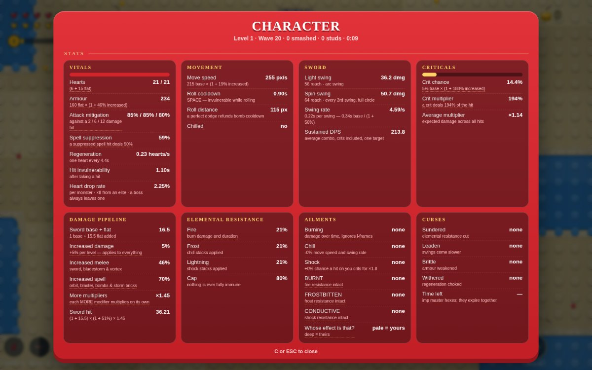

And why every reward can show you exactly what it would change, spell by spell, before you
take it — grey for now, green for better, red for worse:

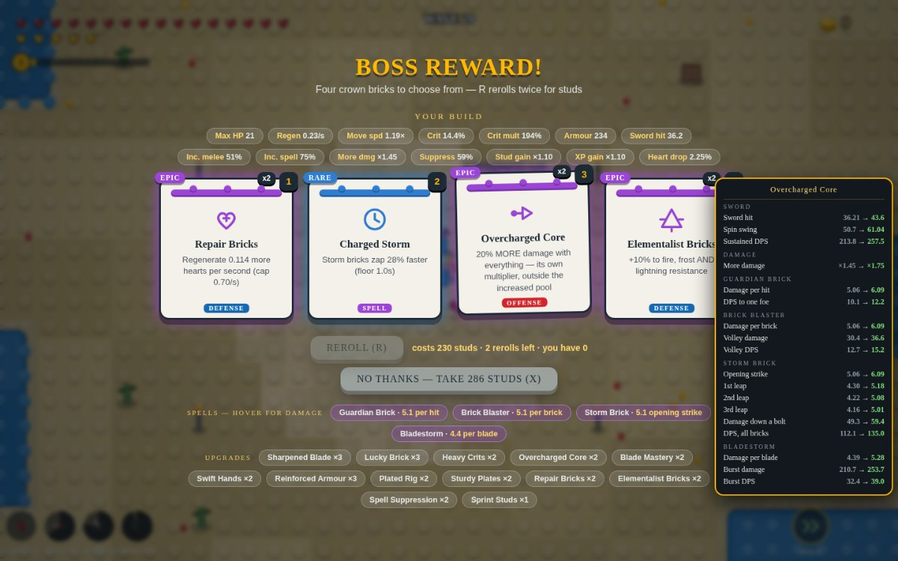

---

## Rarity

Five tiers. Measured across 400,000 rolls per cell on the default difficulty:

| Roll source | ⬜ common | 🟩 uncommon | 🟦 rare | 🟪 epic | 🟧 legendary |
|---|--:|--:|--:|--:|--:|
| **Wave end** | 57.8% | 25.9% | 12.0% | 4.0% | **0.44%** |
| **Level up** | 49.7% | 29.7% | 15.0% | 5.0% | **0.56%** |
| **Chest** | 29.7% | 33.6% | 25.7% | 9.9% | **1.11%** |
| **Boss chest** | — | 21.3% | 48.5% | 27.2% | **3.05%** |

A legendary roll is all-or-nothing: it is spent on a legendary-gated brick or nothing at
all, and no lesser roll can ever reach one. A live **fortune brick** is rarity find as well
as a stud multiplier — up to +25% toward the good tiers.

### What a roll is allowed to hand you

**One card leans on your favourite, not all three.** Weighting every slot meant a
favourite's own bricks crowded the whole screen — pick `Elemental Arts` and all three
filled with elemental increases, so a new spell almost never got a look in. The first card
drawn is the weighted one at ×3.2; the other two are drawn flat. Two-or-more favourite
cards on a screen fell from 40% of rolls to 18%, and spells got their slot back.

**A new spell wears a blue `NEW` ribbon**, tilted across the top corner, so a card that
costs you a slot never looks like a card that deepens what you already cast.

**A chest cannot hand you a spell at all.** It is a reward for exploring, not a way to
reroll your build: chests draw from the pool with every spell-granting brick filtered out,
so what they give you always deepens something you already own. Level-ups and wave rewards
still offer the spells themselves.

**At most one defence and one utility on a screen.** Two ways to survive side by side is a
choice between two halves of the same thing, so once a DEFENSE brick is drawn every other
defence leaves the screen, and the same for UTILITY. Offence (spells included) can come
twice.

**Defences and attributes follow the weapon in your hand.**

| Weapon | Usual drop | Still turns up, less often |
|---|---|---|
| Sword, mace | armour, strength | evasion, energy shield, dexterity, intelligence |
| Axe, bow | evasion, spell suppression, dexterity | armour, energy shield, strength, intelligence |
| Staff, scepter | energy shield, intelligence | armour, evasion, strength, dexterity |

A brick of the weapon's own kind is drawn at ×1.5, one of the other two at ×0.35: over a few
thousand screens a sword sees its own defences about five times as often as either of the
others.

**Conversions are drawn at half weight**, and the ones that end in **chaos** (The Unmaking,
Creeping Blight, Rotgale, Sour Ending) at a quarter. Every conversion is uncommon or better,
and every chaos conversion rare or better.

---

## The boss ladder

A boss every fifth wave, an ULTRA every tenth, and the grand raid at fifty. Spawned for
real and read off the live body — and since a boss rolls its own **traits**, every row is
the mean of twenty of them, which is what you actually meet rather than one run's dice:

| Wave | | Boss | Mob lv | Health | Armour | Hit | Spell suppression |
|--:|---|---|--:|--:|--:|--:|--:|
| 5 | boss | VON BRICKTHANE | 1 | 541 | 49 | 6 | 17% |
| 10 | **ULTRA** | OMEGA BRICKTHANE | 2 | 4,640 | 224 | 30 | 39% |
| 15 | boss | LORD LAVABRICK | 3 | 2,051 | 209 | 29 | 21% |
| 20 | **ULTRA** | MEGA BONE BARON | 4 | 12,219 | 944 | 98 | **68%** |
| 25 | boss | THE DREAD ROOST | 5 | 4,275 | 489 | 62 | 23% |
| 30 | **ULTRA** | ULTRA LAVABRICK | 7 | 19,071 | 829 | 174 | 44% |
| 35 | boss | THE BONE BARON | 9 | 4,334 | 952 | 99 | 51% |
| 40 | **ULTRA** | OMEGA BRICKTHANE | 12 | 47,809 | 1,370 | 461 | 39% |
| 50 | **RAID** | every boss at once | 22 | — | — | — | — |

The **Mob lv** column is the compounding monster level from
[They have a level](#they-have-a-level) — it is most of why the wave-40 ULTRA is four times
the wave-30 one.

Spell suppression is the boss's own — a chance to halve any spell that lands on it. The
skeletons have the most of it, which is what the bones were always for. The **MEGA BONE
BARON** does not only throw bones: it hexes you with a fan of curse bolts, and it blesses
its whole court — and itself — with armour, damage and swing rate.

**No two fights are the same.** Every boss rolls traits when it wakes — one normally, two
from wave ten, three for an ULTRA — drawn from `SWIFT`, `IRONCLAD`, `BRUTAL`, `VITAL`,
`WARDED`, `VENOMOUS`, `RESTLESS`, `LEGION` and `THORNED`. They are printed on its health
bar, so the LORD LAVABRICK you meet this run is not the one you learned last run.

---

## Drops

Every prize is rolled **per monster**, so a wave of a hundred bodies is a hundred rolls.
An **elite rolls every line eight times over**.

| | Per monster | Per elite | What it does |
|---|--:|--:|---|
| ❤️ Heart | 1.00% | 8.0% | ×1.5 regeneration for 30s — **stacks five deep** |
| 🧲 Magnet | 0.34% | 2.7% | hoovers up every **stud** on the field for 30s |
| 🍀 Fortune | 0.34% | 2.7% | ×2 studs and XP, and up to +25% rarity find |
| 📦 Chest | 0.34% | 2.7% | a reward roll on the chest table |
| 💢 Rage | 0.08% | 0.64% | ×2 damage, a MORE multiplier, for 30s |
| 🛡️ Ward | 0.08% | 0.64% | +40 armour and +12% all resistance per stack, to ×2 |
| 💛 Golden heart | 0.11% | 0.88% | **+3 maximum hearts, permanently** |
| ❓ Mystery chest | 0.06% | 0.48% | contents rolled when it breaks — see below |

**A boss always leaves a heart, a magnet and a chest.** On top of that it rolls 28% for a
fortune and for a golden heart (at 0.6× that), and 12% each for rage and ward — the two
that take you straight to a cap stay scarce even here.

**A second one is never wasted.** Pick up a magnet, fortune, rage or ward while that buff is
already running at its ceiling and it **adds 30s to the clock** instead of putting it back to
30: three magnets in a row is 90 seconds of magnet. The ward's second pickup is still its second
stack (×1 → ×2, clock back to 30); from the third on, every ward is time. The clock holds at most
**150s** — five pickups' worth — and the ring round the buff's icon drains against however long
that clock actually is. Hearts are unchanged: they already stack five deep.

**Hearts get commoner as the monsters level up.** Every level a monster has adds **3%** to
its heart chance (a level-30 monster drops hearts ×1.87 as often as a level-1 one). There is
no brick for it any more — Generous Smith is gone — though the tree's heart-drop nodes still
*increase* the chance, up to **+200%**.

### What you threw back

**A brick you paid studs to reroll away goes scarce for 3 to 5 waves** — rolled per brick, so
they do not all come back at once. Paying to get rid of three cards and being shown one of
them on the very next screen is the reroll not working.

**Scarce, not banned.** It is still in the pool and weighted to a fifth of its usual chance,
which measures out at roughly 1% of screens against 4.5%. Banning it outright would turn the
reroll into a way to *delete* cards from a run, and a brick you rejected at wave 4 for having
no fire yet may be exactly what you want at wave 9.

### The mystery chest

Rarer than an epic reward roll and commoner than a legendary one — about **3 a run**,
against 20 ordinary chests. It wears no tier: it cycles every colour on the ladder with a
`?` on the lid, and what is inside is rolled at the moment it comes apart. Measured over
200,000 rolls:

| ⬜ common | 🟩 uncommon | 🟦 rare | 🟪 epic | 🟧 legendary |
|--:|--:|--:|--:|--:|
| — | 20.9% | 33.3% | 35.2% | **10.7%** |

One in six bosses leaves one as well.

### What that actually comes to

Measured over 60 runs of a full 40-wave game — every wave composed for real, every body
rolled, boss spoils included:

| Prizes per wave | waves 1–10 | 11–20 | 21–30 | 31–40 | whole run |
|---|--:|--:|--:|--:|--:|
| Bodies in the wave | 53 | 92 | 102 | 125 | 93 |
| ❓ Mystery chest | 0.04 | 0.08 | 0.09 | 0.11 | **0.08** |
| ❤️ Heart | 0.69 | 1.13 | 1.25 | 1.39 | **1.13** |
| 📦 Chest | 0.34 | 0.50 | 0.60 | 0.65 | **0.52** |
| 🧲 Magnet | 0.39 | 0.52 | 0.53 | 0.64 | **0.51** |
| 🍀 Fortune | 0.27 | 0.38 | 0.39 | 0.47 | **0.36** |
| 💛 Golden heart | 0.10 | 0.14 | 0.13 | 0.18 | **0.14** |
| 💢 Rage | 0.07 | 0.08 | 0.12 | 0.14 | **0.10** |
| 🛡️ Ward | 0.06 | 0.10 | 0.09 | 0.15 | **0.10** |

Across the whole forty waves that is roughly **45 hearts, 21 chests, 20 magnets, 14
fortunes, 6 golden hearts, and four each of rage and ward.** The two doubling bricks are
things that happen to a run, not things it runs on.

A magnet pulls **studs only**. Every prize in that table is something you walk to — and
nothing in it can land where you cannot reach it: studs, prizes and chests are all shoved
back onto walkable floor the moment they touch down, so a lake or a boulder never eats one.

**The floor has a ceiling.** A wave of 130 bodies rolls 130 times, so late waves used to
carpet the ground whatever the odds said. A prize that would be the fourth of its kind
already lying around simply does not appear: **3 of each buff, 10 hearts, 5 chests**. Pick
them up and the tap opens again.

---

## The combination panel

There are four weapons and thirteen favourites, and the interesting question is never what
either one does on its own — it is what the pair opens with. *What if I put Brickbane on a
staff? What does a mace do to Sword & Steel?* The panel on the right-hand edge of the title
screen answers it before you commit, and it answers it by **playing the combination**, not
by describing it.

Picking a weapon or a favourite stands up a **throwaway hero** from `newPlayer()`, puts the
weapon in its hands, applies the favourite's starting kit, runs `syncStats()`, and then reads
the finished numbers off **the same functions the game itself plays with** — `physDamage()`,
`boltDamage()`, `swordDps()`, `critChance()`, `armourValue()`. Nothing in the panel is
estimated, restated or maintained by hand, so it cannot drift from the game the way a written
table would. The live hero is put back untouched afterwards.

Each row carries its difference from **running that same weapon with no favourite at all**,
so the favourite's contribution is never guesswork — and the trade is honest in both
directions. `No Favourite` is not nothing: it hands you a heart, 10 armour, +5% damage and
+4% move speed as a consolation prize, which is why committing to Brickbane reads as
**−14% hearts** and **−100% armour** next to it. That is the actual price of the spell.

**Two panels, not one.** The numbers and the brick list answer different questions — *what
do I open with* and *what will I be offered* — and stacking them in one column made a panel
taller than a laptop window, which is how it grew a scrollbar and started clipping. They sit
either side of the red box now: the stats, the run's **ceilings** and every ability's
**floor** on the left, the bricks on the right. The title screen also scrolls when it has to
and stops centring the moment centring would push the start button off the top, which is the
flex overflow trap that was cutting the box in half on a short window.

The panel also lists **every brick the favourite weights toward you**, shown at RARE, with
each description rendered against that same previewed hero — so Brickbane's `Choking Spread`
reads *"widen the wedge 90° → 159°"*, starting from the 90° the favourite already gave you,
rather than from the 35° a hero who owns no Brickbane would have.

**A brick is judged on the hero the favourite builds.** This matters more than it sounds.
Every Brickbane brick requires that you *own* Brickbane, which the favourite hands you — ask
that gate on the blank hero standing in the menu and all five read as locked, and the panel
blames the weapon for something the weapon had nothing to do with. So the gate is asked of
the previewed hero. When a brick still says no, the same question is put to the **other three
weapons**: a yes anywhere else means the weapon is genuinely the blocker and the brick is
greyed out with *"never offered to a staff"*; a no everywhere means it is simply a brick you
unlock later in the run, which is not a warning and is not greyed.

That wording is deliberately broader than "not for a staff", because two different things
land in the same place: a brick can be the wrong *class* — the blade tree on a caster — or
the weapon can already sit on that stat's **cap**. Either way you will never be offered it,
and that is what the panel promises.

---

## Every buff and debuff

Four separate systems, and they never touch each other's pools:

- **prizes** you pick up
- **ailments** that stack on you
- **curses** that are hexed onto you
- **marks** you put on a monster, and buffs the monsters carry themselves

Everything below is read off the code, not off memory.

<details>
<summary><b>Open the full tables</b> — six of them, every effect and every stack limit</summary>

### 🎁 What you pick up

All four ground prizes run the same **30 seconds**, and picking another one up refreshes
the clock rather than queueing behind it.

| | Effect | Stacks to |
|---|---|---|
| ❤️ **Heart** | Regeneration ×1.5 / 1.85 / 2.10 / 2.30 / **2.45** | 5 — and never ×7.5 |
| 💢 **Rage** | **MORE** damage, its own multiplier outside every increase — and your **minions'** too | ×2 |
| 🛡️ **Ward** | +40 armour and +12% to every resistance per stack — and a curse cannot strip it. Your **minions** get it as well: the armour against physical blows, the resistance against fire, cold and lightning | ×2 |
| 🍀 **Fortune** | ×2 studs and XP, plus up to **+25% rarity find** on reward rolls | ×2 |
| 🧲 **Magnet** | Hoovers up every **stud** on the field. Studs only — it will not drag a chest to you | — |
| 💛 **Golden heart** | **+3 maximum hearts, permanently.** The only prize that outlives its timer | — |

Maximum hearts come from three rungs: `Sturdy Plates` adds them flat, **`Reinforced Frame`**
is an epic **+40% increased** (+60% at legendary), and `Titanium Chassis` is a legendary
**100% MORE**, twice over.

**Low life is 10% of your maximum.** The screen pulses red and your first row of hearts throbs
when your life is at or below a tenth of what it can be — energy shield does not count, so a
1-heart shield build only sees it when the one heart is nearly gone.

### 🔥 Ailments on you

Elemental stacks have **no ceiling**, and every **fifth** one is spent *breaking* something.
The break leaves a **brand** behind, and brands stack without limit — so resistance can be
driven below zero, and at **-100% you take double**.

| | What a stack does | What the 5th stack breaks | The brand it leaves |
|---|---|---|---|
| 🔥 **Burning** | 3 damage over 12s, per fire, scaled by fire resistance. Ignores i-frames | becomes a pool of damage over time | **BURNT** — -11% fire resistance, 22s |
| ❄️ **Chill** | -9% move speed and swing rate, floor 30% | **frozen solid for 3s** | **FROSTBITTEN** — -11% frost resistance, 22s |
| ⚡ **Shock** | +10% chance a hit on you crits for **×1.8**, cap 95% | every hit against you crits | **CONDUCTIVE** — -11% lightning resistance, 22s |

Resistance is capped at **80%** — nothing is ever fully immune — and it scales down both the
elemental damage of a hit *and* the strength of the ailment that hit applies. Each element
has its own **0.7s** application cooldown, so standing in a fire does not spam stacks onto
you sixty times a second.

### 🟣 Curses on you

Imp masters and the **MEGA BONE BARON** hex you. All four stack **9 deep**, the magnitude is
read straight off the stack count, and they expire together.

| | Effect | Per stack | Ceiling |
|---|---|--:|--:|
| **SUNDERED** | elemental resistance cut | -12% | -90% |
| **LEADEN** | swings come slower | -11% | -150% |
| **BRITTLE** | armour weakened | -13% | -92% |
| **WITHERED** | regeneration choked | -16% | -95% |

### 🗡️ What you put on a monster

| | How you inflict it | What it does |
|---|---|---|
| ☠️ **Poison** | Brickbane's gas, 1–3 doses a touch | Every dose bites at once. **9 / 18 / 36** deep on a monster, **12 / 24 / 48** on a boss, by Spore Burst rank. Green beads orbit the body; past 12 the count takes over |
| 🩸 **Bleed** | Any **attack** that lands physical and rolls it — **0%** until you buy it, and a critical does not help | 40%/s of the hit that opened it for **11s**, up to 70%/s. **Stacks 8 deep**, all biting together; a 9th cut displaces the shallowest wound or is discarded. Ignores armour, and **40% less while the body stands still** |
| ❄️ **Chilled** | Any hit that lands as cold and rolls it — **always** on a cold critical, and always off Block Freeze | The body crawls at **45% speed**. **Five stacks freeze it solid** |
| ⚡ **Shocked** | Any hit that lands as lightning and rolls it — **always** on a lightning critical | **+7% damage taken per stack, 5 deep** — from *everything* you own, not just lightning. A multiplier on the body, so it sits outside your own damage ceiling. Arcs crawl its silhouette while it holds |
| 🧊 **Frozen solid** | Block Freeze with *Absolute Zero* | **3s** of no AI, no attacks, no contact damage |

Both lingering damages read the one **increased damage over time** pool that `Rotbrick`
feeds, and each drips its numbers in its own colour — green for the rot, red for a wound.

### 👹 What monsters get

| | Source | Effect |
|---|---|---|
| ⭐ **Elite** | rolled on spawn | ×3.4 health, ×1.5 damage, 12% bigger, 2× studs and XP, **every drop line eight times over** — and it arrives with a **court of 4–9 minions** ringed around it |
| 🟦 **Magic-touched** | rolled on spawn | ×1.18 health, ×1.12 speed, **12% less damage taken** — and it comes as a **band of 6–15**, not three copies |
| ✨ **EMPOWERED** | an **overseer's** call, or the MEGA BONE BARON's | +15% health, +10 armour, +8% spell suppression, +1 damage and **+25% elemental power**, per stack. Caps at **3** |
| ⚡ **Shock arcs** | your storm bolts, with `Conductor` | Lightning crawls the body's silhouette while shock holds on it, deepening with the stack count; at five it sparks off |
| ☣️ **Poison** | standing in a **blight pool** | The pool does not *hit* you, it **poisons** you: a dose every 0.55s, each running 5s, all biting at once, up to 8 deep. It ignores armour, and it keeps working after you have walked off — stepping out stops it *spreading*, not stops it. Listed with your other ailments |
| 💚 **Warden's aura** | the **greenwarden** | Regenerates **5.5% of their own maximum per second** to everything within 240 — but never to itself. He is the fattest body on the field that is not a golem or a boss (**95 base**, against a bastion's 46) and shrugs off chip damage: he deals no damage at all, so the health bar *is* the fight, and at 30 he popped before the aura ever mattered |
| 🦴 **Blessed** | the MEGA BONE BARON, on itself | +18% armour, +12% damage, faster swings and +5% suppression, and it can do it again |

### 👑 Boss traits

Rolled fresh when the boss wakes — **one** normally, **two** from wave ten, **three** for an
ULTRA — never the same one twice, and printed on its health bar.

| | Effect |
|---|---|
| **SWIFT** | ×1.20 move speed, swings 15% quicker |
| **IRONCLAD** | ×1.7 armour, and 10% slower for it |
| **BRUTAL** | ×1.35 damage |
| **VITAL** | ×1.30 maximum health |
| **WARDED** | +25% spell suppression, to a ceiling of 85% |
| **VENOMOUS** | every touch sets a **burning** stack on you — the trait predates poison and still applies fire |
| **RESTLESS** | attacks come round 30% quicker |
| **LEGION** | brings ×1.6 + 1 of its court |
| **THORNED** | standing next to it costs you 25% of its hit |

</details>

---

## Every cap

Nothing in the game is unbounded. A brick that would push past its ceiling stops being
offered at all.

<details>
<summary><b>Open the ceiling table</b> — every number that stops</summary>

| Defence | | Spells | | Prizes | |
|---|--:|---|--:|---|--:|
| Armour reduction | 85% | Guardian bricks | 15 | Rage | ×2 |
| Elemental resistance | 80% | Ring reach | 190 px | Ward | ×2 |
| Critical chance | **80%** | Arrows a shot | 5 | Fortune | ×2 |
| Critical multiplier | **300%** | Arrow pierce | 8 | Heart stacks | 5 |
| Regeneration | 0.70/s* | Storm leaps | 15 | Poison on a monster | 9 |
| Bladestorm swords | 150 | Brickbane doses | 3 | Spore Burst reach | 210 px |
| Bleed chance | 100% | Bleed damage | 70%/s | Poison, Spore Burst ×2 | 36 / 48 |
| Bleed wounds | 8 | Fully opened | 560%/s | | |
| Curse stacks on you | 9 | Poison on a boss | 12 | Shock on a monster | 5 (+35%) |
| Monster level | **100** | Storm shock chance | 100% | Poison on you | 8 doses |
| Buffs on a monster | 9 unique | Monster resistance | 90% | Elite court | 9 |
| | | | | Magic band | 15 |
| Slam width | **180° / 360°** | Slam range | 430 px | Slam speed | 1400 px/s |
| **Skill points** | **60** | Tree cost | 444 | Points per wave | 1 |
| Teeth biting one body | 3 | Slam of the Elements | ×2 | | |
| Flat armour | 520 | Storm bricks | 5 | | |
| Increased armour | +200% | Storm forks | 2 (40 nodes) | | |
| | | Gas reach | 430 px | | |
| | | Bombs | 8 | | |
| | | Blast radius | 110 px | | |
| | | Cluster ranks | 2 | | |

</details>

### The damage ceiling

Increases and MORE multipliers were the two numbers nothing ever stopped. An hour into a
run they were both past **+800%**, which is not a build, it is an overflow — so both now
have a ceiling, and so does every ability's cooldown:

| | ceiling | what it is |
|---|--:|---|
| **Increased damage** | **+400%** | *every* increase that applies to one hit, summed: levels, physical, spell, elemental, all of it |
| **MORE multiplier** | **×3.00** | every permanent MORE together. A timed buff — rage — multiplies on **top** of it, on purpose |
| **Damage over time** | **+400%** | the Rotbrick pool, the same ceiling as a hit |
| **Critical chance** | **80%** | |
| **Critical multiplier** | **300%** | |

The **pools stay uncapped**, as every pool here does — a ceiling on a pool quietly makes
the next brick worthless while the bench goes on selling it. The ceiling sits on the
**derived** number, in one place that every attack in the game reads, and the bricks that
feed it stop being offered once you reach it. The character sheet prints the number the hit
actually uses and says *"— at the cap"* when the pool behind it has run ahead.

### Ability floors

`Quickening` is **attack speed** — your own hands, the swing or the bolt. `Runic Tempo` is
**cast speed**: every *ability* you own, all at once, and the only brick that touches all of
them. They are increases, so an ability's own rate bricks, the global cast-speed pool and
the weapon's attack speed all **sum** into one pool per ability — none of them multiplies.

Each ability then stops at its **own floor**, which is what keeps it recognisable however
much tempo the hero buys:

| | floor | | floor |
|---|--:|---|--:|
| Storm Brick | 1.00s\* | Block Freeze | 3.50s |
| Bladestorm | 2.00s | Bomb Volley | 2.00s |
| Blade Vortex | 3.00s | Brickbane | 1.10s |
| Guardian ring | 7.5 rad/s | | |

Runic Tempo stops being offered once every ability you actually own sits on its floor.

\* The storm brick's **base** is a flat 2.00s and it has no rate brick of its own — only
the global cast speed and a caster weapon can move it, and only down to 1.00s. Owning more
bricks is what makes the storm come round faster, because the stagger is the interval
divided by the bank.

A **favourite** lifts the cap of its own spell by one, so a Storm Brick run reaches six
hovering bricks and a Bomb Volley run nine bombs. The spell its kit hands you counts as
already taken, so it is never offered back to you as a first pick.

\* Regeneration is a **share of the bar, not a number of hearts** — but not one for one.
It scales with your maximum at a fractional power, so a bigger bar does regenerate faster
without healing in the same time regardless of size. Three Repair Bricks: 18 seconds to
full at 6 max hearts, 49 at 60, 102 at 300. Between waves it runs at **×2**.

**Armour** is `Armour / (Armour + 5 × hit)`, capped at 85% — strong against a hail of
small hits, thin against one big one. Fully capped at 1,560 armour value, a 5-damage hit
lands for 0.8 and a 120-damage hit still lands for 33.

**BLEED** is the attack half of damage over time, and it is Path of Exile's rule set. No
swing opens a wound on its own, critical or not: bleed is the one ailment a critical does
**not** hand you, so the chance starts at **0%** and is always a brick you buy. What a crit
buys instead is the three elemental ailments, which is where the crit tree points.

A wound ticks for **40% of the hit that opened it, every second, for 11 seconds** — 440% of
that hit in total — rising to **70%/s** with Deep Cuts. It reads the same increased
damage-over-time pool Rotbrick feeds, and it ignores armour, because the opening hit
already paid it.

**Wounds stack eight deep** and all of them bite at once — 320%/s of a hit on a fully
opened body, 560%/s with Deep Cuts maxed. Past eight, a new cut has to *earn* its place:
it displaces the **shallowest** wound already open, and if it cannot beat even that one it
is thrown away. So the way to hurt a boss is to park on it and keep swinging, trading your
worst wound up for a better one on every hit. Melee's reward for standing in the dangerous
place.

And a body that has stopped moving bleeds **40% less**. Freezing a bleeding monster is not
a free win.

**You are not invulnerable between hits.** The window after taking damage is **0.10s**,
not a second — everything landing on you counts, and a crowd is a crowd.

Hearts stack at **×1.5 / 1.85 / 2.10 / 2.30 / 2.45** — five of them are worth two and a
half, never five. Arrow pierce costs the arrow **15% of its damage per body** it has gone
through at one rank, easing to 10% once all eight are bought. Chaos Arrow pierces everything
and pays nothing for it — that is the legendary.

**Scattershot** no longer divides the damage it spreads. Each shard keeps a share of the
whole brick — **50%** at the first rank, **25%** at the second — so three shards are worth
**1.5×** one brick and nine are worth **2.25×**. Coverage *and* power, which is what a
legendary ought to buy.

---

## Difficulty

| | Monster HP | Monster damage | Count | Pack size | Reward rolls |
|---|--:|--:|--:|--:|--:|
| **EASY** | ×0.70 | ×0.75 | ×0.80 | ×0.6 | ×0.85 |
| **HARD** *(baseline)* | ×1.00 | ×1.00 | ×1.00 | ×1.0 | ×1.00 |
| **NIGHTMARE** | ×1.85 | ×1.55 | ×1.45 | ×1.9 | ×1.25 |

Nightmare also starts the roster four waves ahead of you, and pays about 1.7× the
legendary rate of Hard for the privilege.

---

## Monsters

### The dead that walk

The crypt has a new family, and it shambles in from **wave 1**:

| | when | what it does |
|---|---|---|
| **Zombie** | wave 1 onward | Walks at you and slams you with both hands. When it dies it has a **40%** chance to get up again as a **crawler** — its upper half, dragging itself after you. |
| **Crawler** | from a dead zombie or runner | Slow and low; the hands still hurt. It does not get up again. |
| **Bloater** | waves 5–10 (its era's roll) | Round, slow and **tanky**. It plants its feet and retches **plague breath** — a 150px cone that turns after you for a second, **poisoning** you and rotting any minion in it. When it dies it **bursts**: 8–11 body parts fly every way, each a physical hit on you or your minions. It leaves nothing behind. |
| **Runner** | mid game | A zombie that sprints — more than twice the pace. Also gets up as a crawler. |
| **Hulk** | later | The original, bigger, with harder hands and much more life — and it gets up as a **big crawler**. |

Every zombie that stays down leaves a corpse for a [summoner](#raise-zombie--the-graveyard). A
body raised by a [breach](#breach) is breach stuff: it neither crawls on nor leaves anything.

Six things happen to a monster between wave 1 and wave 50, and they compound: it gains a
**level**, it hits for what its own row says it hits for, it can carry up to **nine** named
buffs, it arrives in a **pack**, the whole **wave** gets a modifier, and it **resists** what
it is made of.

### They have a level

The wave curve is a **polynomial**, and a polynomial flattens in relative terms. By wave 50,
ten more waves bought the roster about a third more health — which, against a hero whose own
damage now has a ceiling, read as no change at all. Wave 50 and wave 60 felt the same
because proportionally they nearly were.

A monster now carries a **LEVEL**, separate from the wave it spawned in. Each level is
**+11%** health, damage and armour, and it **compounds** — multiplied on **top** of the wave
curve rather than added into it.

**The cadence has bands.** One rate for the whole run could only be wrong at one end or the
other: slow enough to leave the opening alone meant the late game flattened again, fast
enough to keep the late game climbing put a level on wave 6.

| from | a level every | |
|--:|--:|---|
| **wave 5** | 4 waves | the first level lands *on* wave 5 |
| **wave 20** | 3 waves | |
| **wave 30** | 2 waves | |
| **wave 40** | **every wave** | and it never stops |

Each band counts only the waves inside it, so the schedule is **continuous**: crossing a
boundary never jumps the rank or takes one away.

| | monster level | health, damage and armour |
|---|--:|--:|
| before wave 5 | **0** | ×1.00 — the opening is untouched |
| wave 5 | 1 | ×1.11 |
| wave 13 | 3 | ×1.37 |
| wave 20 | 4 | ×1.52 |
| wave 30 | 7 | ×2.08 |
| wave 40 | 12 | ×3.50 |
| **wave 50** | **22** | **×9.93** |
| **wave 60** | **32** | **×28.21** |
| wave 100 | 72 | ×1,833 |
| wave 128+ | **100** (the ceiling) | ×34,064 |

The ceiling is level **100**, reached at wave 128 — past that a very long run stops getting
harder rather than becoming a wall.

Measured end to end on a real body, a wave-60 brute now has **×3.69 the health and ×3.65
the damage** of a wave-50 one. Before levels existed at all it was ×1.30 and ×1.28, and
under the single-cadence schedule it was ×1.78 and ×1.75.

**This is a large late-game change, on purpose.** Wave 50 went from ×3.15 to ×9.93 and wave
60 from ×3.88 to ×28.21 — roughly **3× and 7× tougher** than the schedule it replaced. The
first twenty waves barely move; everything past forty climbs every single wave.

The level shows beside the wave number in the HUD once it starts to bite, and on the
character sheet with the arithmetic behind it.

---

### They hit for what their own row says

A whole class of monster abilities was landing a **hardcoded 1 or 2** whatever threw them —
so a wave-50 golem's firebomb cost exactly what a wave-1 imp's did, and armour then ate two
thirds of it. That is the *0.33* you kept seeing.

Every thrown thing now **carries its thrower's damage**, worked out when it leaves the hand,
the way the boss bricks already did. Measured on real projectiles, wave 1 against wave 40:

| | wave 1 | wave 40 |
|---|--:|--:|
| Fire golem's bombs | 2.8 | **147** |
| Ice golem's boulder | 3.5 | **178** |
| Blight gobbet and its pool | 1.0 | **53** |
| Bomber's detonation | 2.6 | **395** |

*(The wave-40 column carries the monster level, which is a flat multiplier on health, damage
and armour alike. When the level cadence was rebanded, wave 40 went from level 8 to level 12
— ×1.52 — and every number in that column moved with it.)*

The same applies to the storm golem's orbs and coils, to meteors, and to every fire and lava
pool left behind — a pool now remembers what left it.

Some monsters were also simply too cheap to be hit by:

| | was | now | |
|---|--:|--:|---|
| **Bomber** | flat 1, forever | ×2.6 its own damage | its whole existence is that one detonation |
| **Jugg** | 2 | **4** | a wall that walks should cost something to be caught by |
| **Marksman** | 1 | **3** | a sniper that plinks is just an archer |
| **Stone golem** kit | 2 | **5** | |
| **Ice / Fire golem** kit | 1 / 2 | **4** | |
| **Storm golem** kit | 2 | **5** | |
| Golem **bodies** | 2 | **3–4** | contact damage, per golem |

*(The marksman does spawn — counted: about **5 a wave at 28** and **12 at 48**. It was never a
spawn problem; it did one damage and so never registered.)*

The **revenant's** shockwave reaches **156** instead of 260 — 40% less, so stepping out is a
real answer rather than a tax. The **pumpkin lord** aims at you now: it was leading your
movement by the whole three-second fuse, which is indistinguishable from throwing at random.
It leads the *flight* only, with half the scatter — the fuse is what gives you time to walk
off it, and that is the actual mechanic.

---

### Nine buffs, not three

A monster's buffs used to be **one counter capped at three**, so every aura in the game
fought over the same ceiling: a body standing in an overseer's empowerment and a pyrolord's
warding simply refused the second one.

They are a **map** now, keyed by what granted them. A body may carry **nine different**
buffs, and each stacks to its own depth — three stacks of fire resistance is **one** of the
nine, not three of them.

Which makes the **elemental lords** worth something they were not: a pyrolord, frostlord or
stormlord **wards everything within 320** with resistance to its own element, 25% a stack,
three deep. A pack led by a pyrolord is a pack you do not burn down — and killing the lord
is what unlocks it.

---

### Packs are packs

Three bodies read as *the spawner hiccuped*. A pack should read as a warband walking out of
the trees, so both kinds got rebuilt:

**An elite is one champion with a court**, not three copies of the same thing. Three
identical elites was a damage spike with no shape to it; one genuinely hard body ringed by
**4 to 9 minions** — the cheap end of the roster, or a golem's own minis — is something you
have to fight your way *into*. The elite itself is much harder to pay for it: **×3.4 health
and ×1.5 damage**, up from ×2.2 and +1.

**A magic pack is a band of 6 to 15**, scaling with the wave, and every one of them carries
the modifier — it used to be three copies each carrying the full thing. Each body's share is
smaller to pay for the extra bodies: **×1.18 health, ×1.12 speed, 12% less damage taken**,
down from ×1.5, ×1.3 and 30%.

Magic-touched is **blue** now rather than purple: purple is already the epic rarity band and
the necromancers' own colour, so a magic pack read as *something arcane* instead of as the
pack modifier it is.

---

### Wave modifiers

Every wave from **6** rolls a modifier, and another every twelve waves after that, up to
four. They are rolled **once**, when the wave is composed, and held for its whole life — so
a wave has an identity you can read off the banner and plan around rather than a difficulty
that drifts under you. They sit under the wave number in the HUD until it is cleared, each
in its own colour, and they go in the combat log too.

| | |
|---|---|
| **HARDY** | monsters have 30% more health |
| **BRUTAL** | monsters deal 25% more damage |
| **SWIFT** | monsters move 18% faster |
| **FRENZIED** | monsters attack 25% faster |
| **PLATED** | monsters have double armour |
| **WARDED** | monsters suppress 30% of spell damage |
| **RESISTANT** | monsters gain 35% resistance to every element |
| **SLIPPERY** | monsters evade 12% of your hits |
| **HORDE** | 40% more monsters, each with 15% less health |
| **OPULENT** | monsters are tougher, and pay double |
| **WARBAND** | one monster in six is an elite |

Each one is a plain multiplier applied **at spawn**, after the wave curve, the monster level
and the difficulty — so a modifier multiplies the finished number rather than a base that
has not been built yet, and nothing reaches into a body that is already standing. A body
gets a **copy** of its species' resistance table for exactly this reason: `RESISTANT` writes
to it, and writing to the shared definition would have made the modifier permanent for the
rest of the run. A test asserts the species comes back clean afterwards.

---

### They resist what they are made of

The hero has had elemental resistance since the first commit and monsters never did, which
meant a fire golem was exactly as flammable as a skeleton — every golem was a reskin as far
as your build was concerned.

| | resists | weak to | |
|---|---|---|---|
| **Fire golem** | fire **90%** | frost **−35%** | shock 20% |
| **Ice golem** | frost **90%** | fire **−35%** | shock 20% |
| **Storm golem** | lightning **90%** | frost **−35%** | fire 20% |
| **Stone golem** | 25% of everything | — | and **×3.2 armour** |
| Lords · mages | 75% · 45% of their own element | the opposite one | |

A **negative** resistance is a weakness and multiplies *up*, so a fire golem takes **135**
from a 100-damage frost hit and **10** from the same hit in fire. Which spell you are
holding decides which golem is a problem.

Stone is the exception on purpose: it is rock, so it is **armour** — and armour only ever
touches *attacks*. You cannot out-swing a stone golem; you burn it. Resistance caps at
**90%** even under `RESISTANT`, so max resistance is a wall rather than immunity.

---

## The skill tree

You used to die at wave 15 and nothing happened: the run was the whole reward and the run
was gone. Now every run banks, and **pushing your best** is worth more than grinding a wave
you have already beaten.

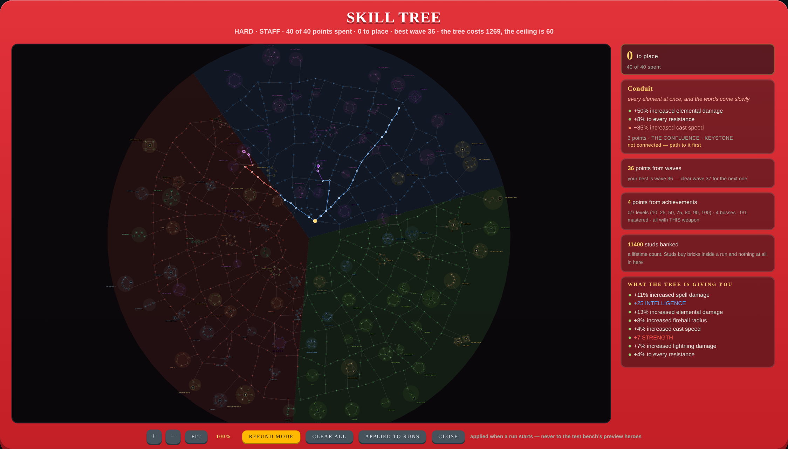

### Spending it mid-run — <kbd>T</kbd>

**A level is worth a point the moment you reach it.** It used to be worth one only when you
*died*: the record was written at the end of the run, so a hero who reached level 38 on a
fresh character spent the whole run with the points they were earning sitting in the future.
A new best level is written on the level-up now, and a new best wave on the clear, with a
`+1 SKILL POINT · T` over your head and a pill beside the level bar while any sit unplaced.

**<kbd>T</kbd> opens the tree mid-run** (so does SKILL TREE on the pause menu), and the world
freezes behind it exactly as it does behind the character sheet. A node you take lands on your
hero **now** — the tree only ever writes the same pools the bricks do, so applying one node to a
live hero is exactly what applying it at the start would have done. A node that hands over a
brick hands it over there and then.

**Mid-run the tree only grows.** Refunds, CLEAR ALL, loading a preset and the on/off switch
wait for the run to end: taking a point back would mean unpicking a node from a live hero, and
the switches some nodes throw do not unpick cleanly. The death screen still tells you what the
run was worth — it measures from where the run began, not from a record the run already moved.

### Three named presets

**Every tree keeps three.** A preset is a name and a saved allocation, on the same record as the
tree it came from — a sword's build starts at the sword's door and means nothing on a staff's
tree, so each of the twelve trees has its own three. Type a name, **SAVE** keeps what is placed
now, **LOAD** takes it all back and places the preset.

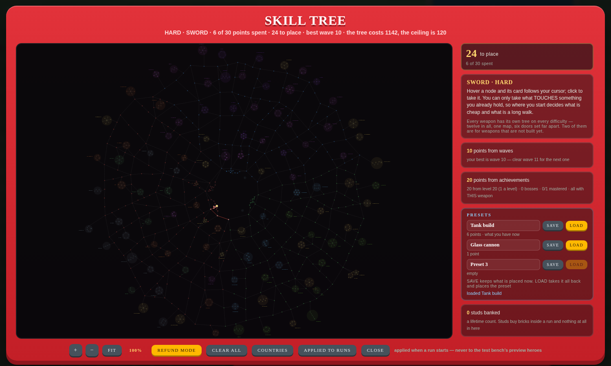

**A preset is bought, not copied.** LOAD places each node through the same rules a click
obeys — touching what you hold, unlocked, affordable — so it can never put the tree somewhere
the tree could not have reached by hand. A preset saved on more points than you have now
places what it can and says how much. A layout change empties presets the way it refunds the
tree, and keeps their names.

**TWELVE TREES.** Every weapon has its own on every difficulty — three difficulties × four
weapons — and **they share nothing**. Points earned on a staff are a staff's; switch to the
axe and you find the axe's own tree exactly as you left it, and switching back finds the
staff's.

**Everyone starts in the middle, and no two weapons start the same way.** Four doors in the
dead centre, and each one opens into a cluster nobody else can reach cheaply — the sword's
is reach and riposte, the mace's is the weight of the slam, the axe's is bloodscent and wild
swings, the staff's is focus and warding. Each door sits in its own country — the sword and
the mace in the red, the axe in the green, the staff in the blue.

### Four beginnings, and all four are on the map

Each door **fans into four paths of three flavoured nodes** — a sword's edge, its footwork,
its guard, its opening — before the plain attribute road takes over. One flavoured node and
then a corridor made the beginning of a build a formality: you pressed a button and then
walked. Three is a small decision of its own, which of the four directions you commit to
before the map opens.

**And every door's paths are open to everybody.** You still *begin* at your own one, and
nothing paths through somebody else's door — so a sword hero reaching the staff's beginning
has to come at it from the far end, up the lane it hangs off. Your own costs you **3**
points; it costs everybody else **5 to 13**, averaging more than double. Leaning into the
beginning next door is a real option, the way it is in the tree this is borrowed from; four
beginnings that only one weapon could ever touch were four quarters of the middle of the map
wasted.

The doors you did not choose are drawn dimmed, so you can see where the axe begins and what
hangs off it without being able to start there.

### A lattice, not a wheel

### The highway

Five rings of **hubs**, each joined to its neighbours around its own ring *and* to the nearest
hubs on the rings either side of it. **Every hub is a travel node and so is every lane node
between them** — the whole of it is one connected piece that pays nothing but attributes. You
can cross the map in any direction without buying a single point of somebody else's build.

That is the rule everything else hangs off, and it is measured: the 592 lane nodes are **one**
connected component, and in each country almost every attribute node it owns is in a single
walkable piece (230 of 231 in the red, 164 of 165 in the blue, 194 of 196 in the green). Every
one of the 180 door-to-prize pairs is reachable on the highway alone, and the worst of them
costs **nothing** extra for staying on it.

**The jumps are long.** A junction is a decision and the road between two of them should not
be a queue: no more than **four** attribute nodes ever sit between one junction and the next,
and the median jump is 336px. A lane that would need a fifth does not get one — it gets longer
jumps, because jumping a long way sometimes is the point of a road. The map itself grew by half
to pay for that: a longer jump is also *fewer* nodes, and the highway's length in points is the
only thing keeping the outer keystones apart — shortened, one walk round the rim collected
every keystone on it for 55 points against a ceiling of 60.

**Clusters never sit on it.** They go in the empty middle of a quad — between two rings and
two radial lanes — and join the road by two or three **connectors**, each from a different
stretch of it. Two is the number that matters: one connector is a pocket you must leave the
way you came, and the point is to leave the road, take what you came for, and rejoin it
further along. A cluster on the outer rim gets one, because there is no further along.

**Every prize on the map can be reached using the highway and nothing but its own cluster**,
and doing it that way costs at most **3** extra points against cutting through whatever
happens to be in the way — mean 0.29. Nothing is ever standing in a doorway.

**A door opens four ways and none of them stops.** Each is a lane to a different hub of the
inner ring, and the first node of each carries the weapon's own flavour instead of a plain
attribute.

**Nine hundred and ninety nodes**, and nothing in it is hand-placed. Hubs come off a ring
table, clusters come off a template library, and both are picked by a hash of where they are:
the map is identical every time you open it, and adding a weapon, a spell or a damage type
extends it without anybody moving a coordinate.

| | |
|---|--:|
| nodes | **990** |
| of which highway | **677** |
| clusters | **98** |
| notables / keystones / legendaries | **20 / 17 / 8** |
| the whole tree, in points | **1072** |
| what the ceiling buys you of it | **6%** |

### Three countries

The map is cut into three wedges, and what lives in a wedge belongs to it. No lane carries a
label saying which attribute it pays — it pays the attribute of the **ground it stands on**,
so a ring changes colour exactly where the border is and the map colours itself.

| | | |
|---|---|---|
| **RED — STRENGTH** | the sword and the mace | physical damage, hearts, regeneration, armour |
| **GREEN — DEXTERITY** | the axe | criticals, speed, bleed and poison, everything that lingers |
| **BLUE — INTELLIGENCE** | the staff | spells, the elements, the cold and the storm |

Conversion is in all three, because every build has something worth converting. Your own third is
markedly cheaper to its keystones than anybody else's.

### What a cluster is

**One or two kinds of stat and nothing else** — a cluster you can read at a glance and want or
not want. QUENCHED is fire resistance and cold resistance. THE EMBER WELL is fire resistance
and increased fire. HEFT is two flat physical nodes. Most of the library **repeats**: the same
three fire nodes turn up in three places around the blue country, the way the same small wheel
turns up all over the tree this is borrowed from, so the library stays short and the map stays
big. Two copies never stand within 1200px of each other.

**Ten shapes**, and the shape changes what buying in costs you:

| | |
|---|---|
| **ring** | a closed loop of five or six; the prize touches every other one |
| **wheel** | the same loop, but the prize touches all of them |
| **arc** | an open bow of four to six, bulging outward, prize inside it — a long way round and a short way |
| **crescent** | a deeper bow with both ends curled in |
| **diamond** | four corners round the prize |
| **line** | a straight run of three or four with the prize past the end |
| **chain** | the same run, zig-zagged |
| **hook** | an L: out, then a turn along the ring |
| **star** | no loop at all; every leaf hangs off the prize alone |
| **vee** | a bracket of four with the prize in the notch |

**The figure decides how many nodes there are**, not the list of stats — the stats are dealt
round it and repeat if the figure is the longer of the two, which is what a six-node arc of
*Smoulder, Rimebite, Arcing, Smoulder, Rimebite, Arcing* is for. Before that every template
held three minors and three points on a circle is a triangle, so the whole map was triangles.
**Nothing holds fewer than four**: two stats with a name over them is not a group worth leaving
the road for. Sizes run four to seven.

**And no cluster wears the same figure as one within reach of it** — not one pair on the whole
map does. A group whose neighbour already has its shape takes the next one along, so THE MACE'S
OATH reads differently in each of the three places it lands.

**How wide a figure has to be, and how far it reaches, are asked of the figure** rather than of
a table: it is laid out once at a notional hundred and measured, so six on a ring and six along
a line get the radii they each need and a new shape brings its own answer. If the site cannot
hold it, the cluster carries fewer nodes, or wears a different figure, or the site itself walks
away from the nearest lane until there is room.

### What is on it

- **Every conversion the pipeline allows.** Ten legal pairs, both forms of each, generated
  from `CONV_ORDER` — so the day a damage type is added, every conversion involving it has a
  node on the map without another line of data. Each pair is *guaranteed* a site: left to the
  random fill, four of the ten never landed anywhere.
- **A weapon's own nodes.** `+0.1 flat damage — Sword only`, `+4% increased spell damage —
  Staff only`. Generated from `WEAPON_KEYS`, and the panel greys them out for anybody else.
- **The strange ones**, which change what a build *is* rather than what its numbers are:
  RUNEBLOOD (a heart for every 5 intelligence, and 15% less hearts otherwise), VOIDCALL (all
  your lightning arrives as chaos), THE SOUR SUN (your fireballs are not made of fire any
  more), FROSTBOUND (nothing you swing is made of metal any more), THE OPEN GUARD (you wear no
  armour at all and nothing cast at you lands properly).
- **Eight legendaries, five points each**, on the outermost ring: *Born With Brickbane*, *Born
  With Block Freeze*, one for every spell — and what they hand over is not a number but a
  **brick**. You begin the run already holding it. Generated from `SPELL_KEYS`.

**The outer ring is one ABILITY apiece.** THE ORBIT, THE BARREL, THE STORMHEAD, THE
WHIRLING, THE VORTEX, THE COLD SNAP, THE ORCHARD, THE ORDNANCE — `+1 damage with the
Guardian Brick`, `+1 arrow pierce`, `+1 Storm Brick fork`, `+12% increased Bomb
Volley rate`. A tree that only ever says *+5% damage* has no opinions; a node that names one
of your bricks makes you re-read the map every time the deck hands you something new.

**Resistance is everywhere, and paired.** QUENCHED is fire *and* cold, TEMPERED is cold
*and* lightning, GROUNDED is lightning *and* suppression — the elemental wells give you the
resistance and the damage of the same element together, and WARDING gives a little of all
three.

**One currency you can see: skill points.** They come from two places, and both are
*derived* — nothing is stored as a counter:

**EVERY WAVE IS A POINT, AND STUDS ARE NOT.** Studs were the gate, and the gate was the
problem: a run that got further than any before it paid exactly what one that shuffled round
wave 12 hoovering bricks did, so the tree was a grind rather than a record.

**Your best wave IS your point total.** Reach 38 and you have 38 to place. Reach 40 next
time and you have **two** more — because 40 is your high-water mark, not your fortieth lap.
A worse run pays nothing, however long it was.

| | |
|---|--:|
| **your best wave** *with this weapon* | **1 point each** |
| **your best level** *with this weapon* | **1 point each** |
| first time smashing each of the 8 bosses | 8 |
| **BRICKBANE MASTER** — every capped Brickbane brick at its cap | 1 |
| **the ceiling on everything** | **120** |

**ONE POINT A LEVEL, EVERY LEVEL** — the same as one a wave, so neither of the two things you
do in a run outweighs the other. This was seven milestones once (10, 25, 50, 75, 80, 90, 100),
which paid seven points for a hundred levels and left a dead stretch of twenty-four where
levelling was worth nothing; then two a level, which was generous enough that a deep run filled
the tree on levels alone and the wave count stopped mattering. One is the middle. Your best
level is a high-water mark like your best wave — going deeper pays the difference, doing it
again pays nothing.

**The ceiling is 120.** It was 60, and 60 was reached somewhere around wave 39 — so the back
half of a good run bought nothing at all and the tree stopped being a record of how far you got.
The whole tree costs over a thousand points, so 120 is still a small share of it and a build is
still a set of choices.

**What doubling the points did to the budget:** a stay-at-home build went from **×2.53** total
power to **×3.47** — not double, because the increased-damage caps do their job. And a
**keystone costs 5 points** now instead of 3: at 60 the far corners were simply unreachable
together and the *distance* was the limit, but at 120 a walk that collected every keystone on
the rim cost 67. The price is the limit now — the rim is about **three fifths of everything you
will ever have**, which is a real trade rather than a wall.

**BRICKBANE MASTER** wants stacks, spread, reach, rate, dose length and Spore Burst all at
their ceilings. Flat poison damage is *not* asked for: it has no cap, so "all of it" could
never be true. The point lands the moment the last cap is met — mid-run, with a banner —
rather than waiting for you to die.

Studs are still banked and still counted. They buy bricks inside a run and **nothing at all**
in here.

**The wave you CLEARED, not the one you died on.** Dying to the wave-30 boss is a wave-29
run and the screen says so.

**You bank the square root of what you picked up** — `floor(4 × √studs)`. A full clear
collects about 15× what a death at wave 15 does; banked raw, the early runs this exists to
reward would feel *worse*. The square root compresses that to about 4×. It banks what you
**collected**, not what you are holding, so rerolling never costs you twice.

**The tree costs 1072 points and you can never hold more than 60.** That is the whole design:
at most **6%** of it, ever, so the tree is a set of builds rather than a ladder you finish.
412 nodes — 116 small ones in clusters, 12 notables, 12 keystones, and 268 steps of corridor
between them.

**Every step of corridor is an ATTRIBUTE**, and attributes are the boring numbers you collect
on the way to somewhere interesting:

| | | |
|---|---|--:|
| 🔴 **STRENGTH** | +0.5% increased physical damage, +0.5% increased maximum hearts | *each* |
| 🔵 **INTELLIGENCE** | +0.5% increased spell damage, +0.5% increased regeneration | *each* |
| 🟢 **DEXTERITY** | +0.3% increased critical chance, critical damage and attack speed | *each* |

**Every weapon starts somewhere different on the three** — a mace opens on 20 strength, a
staff on 22 intelligence, an axe on 16 dexterity, and the sword is the only one with a little
of all three. Four bricks hand them over directly and **any weapon and any favourite can be
offered all four**: `Ironbone`, `Runescript`, `Quicksilver`, and `The Whole Brick` for all
three at once.

**What an attribute grants is DERIVED, never written.** A brick that handed you ten strength
*and* poked +5% into the increased-physical pool would double-count the moment a second source
of strength turned up, and the pool would keep the bonus after the strength went away. The
attribute is the pool; the percentage is read off it at the point of use, every rebuild.

> `+0.03 maximum hearts` was a node nobody could feel and nobody could read. Those are
> `+4% increased maximum hearts` now — a percentage of a pool that grows with the build is
> both.

**You cannot drop points wherever you like.** A node has to *touch* something you already
hold, and everything you hold has to trace back to your weapon's door. Every corridor is
walkable from **both** ends and the map is full of loops: knock out any single cluster and
the middle is still reachable from all four doors. There is always more than one route —
each one costs something different.

**Refund is a mode, not a button that eats your tree.** Turn it on and click nodes back one
at a time, free; a node holding up a branch is refused until you unwind the branch. `CLEAR
ALL` is there when you want it.

**Zoom and drag.** The map does not fit on a screen at a size you can read it, so scroll to
zoom toward the cursor, drag to pan, and `FIT` puts the whole thing back. A drag is never
mistaken for a purchase.

> The first version of this captured the pointer on the `<svg>` to follow a drag, which
> retargets the pointer — and the `click` that follows is delivered to the `<svg>` and never
> reaches the node you pressed. **Every node in the tree became unclickable.** `metaplay.js`
> passed anyway, because it drove the map with a synthetic `MouseEvent` that skipped the
> pointer handlers entirely: a test that clicks in a way no hand can is a test that proves
> nothing. It now presses, wobbles two pixels the way a hand does, and releases — and it asks
> the browser, via `elementFromPoint`, whether anything is sitting on top of any node. That
> second check found six more nodes hidden under cluster labels.

**A PATCH NEVER COSTS YOU PROGRESS.** The save carries the version of the tree it was spent
on. Move the tree and every stud, every best wave and every boss stays exactly where it was —
the allocated points simply come **back**, and the tree screen says so in as many words:
*THE TREE CHANGED — your N spent points are back. Spend them again.* A respec, never a reset.

Eight colours of ground — WARFARE, PRECISION, SWIFTNESS, AFFLICTION, VITALITY, ARMOUR,
ELEMENTS, ARCANA — and a gold CORE at the middle. Clusters wear the colour of the ground
they stand on, so the regions read from across the map even before you have taken anything.
Twelve notables sit at the centre of a cluster, and twelve **keystones carry a real
downside**:

| | |
|---|---|
| **Glass Bricks** | +35% increased damage — and **30% less maximum hearts** |
| **Perfect Strike** | +150% increased critical chance — and **half the critical multiplier** |
| **Slow Death** | +60% increased damage over time — and **25% less increased damage** |
| **Slow Burn** | every elemental toll lands 10 waves later — and **30% less XP** |
| **Ironclad Oath** | +50% armour and +10% all resistance — and **20% less move speed** |
| **Bloodthirst** | +20% lifesteal chance and +6% share — and **no regeneration at all** |
| **Hoarder** | **double** the studs you bank — and 20% less increased damage |
| **Scavenger** | chests offer **two** cards — and you can never reroll |
| **Livewire** | the Storm Brick fires twice as fast and forks — and **nothing you do lingers** |
| **Vengeance** | +50% damage over time and a deeper wound — and **60% less critical chance** |
| **Stoneheart** | +35% MORE maximum hearts and +6% all resistance — and **30% less damage** |
| **Conduit** | +50% elemental damage and +8% all resistance — and **35% less cast speed** |

A tree of pure upgrades is a ratchet; a tree of trade-offs is a set of builds. That is why
people still open Path of Exile's tree after ten years.

### What a node looks like

**Every node wears a picture**, and the picture is read off the stat rather than typed in
beside it, so a stat written tomorrow arrives with an icon already on it. They are the same
drawings the bricks and the upgrade cards use: a flame in the tree and a flame on the card
that gave it to you are the same flame. Fire is a flame, cold is a snowflake, lightning a
bolt, chaos a vortex, poison and bleed a bane, spells a rune, crit a target, armour a shield,
health a heart, speed a boot. A conversion wears the type it *arrives* as, because that is
the half of it you will spend the rest of the tree scaling.

**The road wears a plus in the colour of the country it runs through** — red, green or blue —
and nothing else, because that is the whole of what a travel node does. From across the map
the three countries read as three countries and the highways read as highways.

Rank is the frame: a **notable** is a bigger disc, a **keystone** wears a broken ring round
it, a **legendary** a whole second one.

### And nothing sits on anything

Four things a player can see, all measured rather than eyeballed, all of them at zero:

- **No two node circles overlap.** The closest pair on the map is 17px clear.
- **No edge is drawn through a node it does not belong to.** This is most of what *"the nodes
  are overlapping"* turned out to be — the circles were clear of each other and a line ran
  straight over them. Twenty-three did. The layout pass shoves a node off any edge it is
  standing on, and a slip road off the highway picks the node it can reach without crossing
  another one of that cluster's.
- **A cluster's blot holds its own nodes and nothing else.** It used to be a fixed circle
  drawn round where the cluster was *asked* to go; after the layout pass settled it was in
  the wrong place and the wrong size, and it shaded whatever highway ran past — a stretch of
  road inside a shop's shadow reads as part of the shop. It is now measured off where the
  nodes ended up and pulled in clear of everything else, including every other blot.
- **No edge passes within 20px of a node it does not touch either.** "Through the middle" is
  the version a computer notices; what a player sees is a line shaving the edge of a circle.
  The worst on the map clears by 24px.
- **No two lines cross.** Forty-five pairs did. Most were a lane laid over a cluster that had
  grown wide enough to reach it; the rest were slip roads chosen before the layout pass settled,
  so they were aimed at where their two ends were about to stop being. Slip roads are picked
  last now, against final positions, and a way in can be refused for crossing something.
- **Every cluster name is readable.** Twenty-four directions are tried at two distances each,
  and the first that lands on no node and no other name wins. All 98 find one.

Laying all of that out is a node against every other node, forty passes deep. Done the obvious
way that is 56 million sums between opening the game and seeing the title, and it cost three
and a half seconds; the neighbours worth shoving against are gathered once off a grid instead,
and it costs 0.7.

Every one of those is a test, and every one of them was proved to fail against a map broken in
the matching way — the figures forced back to three nodes, the blot back to a fixed circle, the
name placed blind, the slip roads picked before the layout pass, the cluster pinned to the dead
centre of its quad however close the road is.

**Hover anything to read it.** Every node lists exactly what it gives, good and bad, and a
node whose stat does nothing for the weapon you are on says so rather than selling it to
you. A running total of everything you have allocated sits beside the map — the panel and
the hero are read off the same `mods`, so they cannot disagree.

**It does not touch the test bench.** The tree is applied only when a real run starts, so
every preview and throwaway hero reads the raw numbers. A switch on the tree screen turns it
off for real runs too.

### Why it survives being rebalanced

Four invariants, and they are the whole reason the save stays alive through future changes:

1. **The save stores node IDs, never the stats they grant.** The effect is rebuilt from the
   live table every load, so rebalancing a node is free — no migration, no stale saves.
2. **Points spent are derived**, by summing the live table. Change a cost and every save
   re-derives. A node that no longer exists costs nothing, so **a deleted node self-refunds**
   with no migration code at all.
3. **Points earned are derived from the achievements**, never from a counter. Change *"a
   point every 10 waves"* to *"every 5"* and everyone's existing progress re-grants
   retroactively. A counter can never be fixed; a derived value is always right.
4. **Nodes write into the same pools the bricks write into.** Because every ceiling in this
   game lives on the derived value rather than on the pool, the tree is bound by every cap —
   *including caps that do not exist yet*.

A corrupt save resets rather than throwing, and a save claiming nodes it never earned — or
one it cannot reach from its door — is refunded instead of honoured. That is also why the
map could be rebuilt from scratch without a line of migration code: every old node ID is
simply unknown now, so **every existing save got all of its points back to re-spend**.

An older save from before the tree was split by weapon used to be poured into *all four*
weapons, which made the tree look shared when it never was. It now lands on the one weapon
that was selected when it was written, and nowhere else.

**And the budget is a test, not a promise.** `meta.js` walks real routes out of the sword's
own door, spends **exactly** the 60-point ceiling on them — a budget checked on a half-spent
tree is a budget nobody is ever held to — and fails the build if it beats **×2.60 total
power**, damage *times* hearts. Damage alone is the wrong measure: a glass build buys damage
by selling hearts, and a damage-only budget waves it through while punishing an honest one.
The product cannot be gamed, because a node with no downside raises both halves.

Measured at the full 60-point ceiling: a straight build is **×2.09 damage, ×2.39 power**.
Glass Bricks is **×2.79 damage but only ×2.39 power** against **×2.27 / ×2.92** for *the same
walk with the keystone left out* — more damage, less total, which is exactly the trade it
advertises. (Comparing it against a *different* route list measured the two lists as much as
it measured the keystone; dropping the one node out of the one walk measures the keystone.)

The ceiling has gone 26 → 34 → 46 → **60** across four passes. On the second the power did not
move at all, because the tree grew faster than the ceiling did and the extra points went
into corridor. On the third it moved from ×1.60 to ×1.96 — a fully banked tree is now worth
roughly twice a bare hero, and that is what thirty stud points and eight boss firsts buy.

---

## Damage conversion

**Live, on every hit in the game.**

**Five types, one direction.** Conversion only ever runs *down* this list, which is the whole
reason it terminates — there is no arrangement of modifiers that can send damage back round
the loop:

> **PHYSICAL → LIGHTNING → COLD → FIRE → CHAOS**

**Two forms, and the difference is what happens to the source:**

| | |
|---|---|
| `#% of X Converted to Y` | takes the damage **out** of the source type |
| `Gain #% of X as Extra Y` | leaves the source intact and adds a copy as the new type |

**When it happens:** after flat added damage joins the base, and **before** any increased or
more multiplier touches it.

**A converted part is scaled by every type it has ever been.** A sword swing converted to
cold and then to fire keeps increased physical damage for how it was built, *and* gains
increased cold for the road it took, *and* increased fire for what it arrived as — all three,
once each. (The global elemental pool is paid once however many elements the chain touched;
paid per element it would be a free multiplier for anyone converting twice.)

That is why damage travels the pipeline as **parcels** rather than as one number per type.
Each parcel remembers its own history and splits when it converts. Totals cannot carry that:
cold arriving from two different chains would have to share one provenance, and whichever one
you picked would overpay the half that did not take that road.

**What the monster does about it: nothing to do with you.**

- A part that arrives as **cold** pays **cold resistance**, whatever it set out as.
- **Only the part that is still physical ever meets armour.** Converting a swing to fire is
  how you walk past a golem's plate, and that is the point of the entire mechanic.
- A **spell** meets suppression however it has been converted — being cold does not stop it
  being a spell.
- **What lingers is not converted again.** A bleed, a burn and a poison were all built the
  moment they were inflicted; running them back through the pipeline on every tick would
  convert the same damage over and over.

**How it is wired, and why nothing upstream had to change.** Every number in this game is
linear in its base — a hit is `base × (1 + increased) × more` — so the *effect* of conversion
does not depend on the base at all. Run the pipeline on a base of **one** and you have both
the ratio between the converted hit and the plain one and the share each type ended up with.
The swing still builds one number the way it always did; `hitEnemy` corrects its size and
mitigates each share as what it became. A hero who converts nothing takes a one-line fast
path that is arithmetically identical to the code that was there before.

**Fifteen bricks write it**, and seven skill-tree nodes do too. Every legal pair in the
chain has something behind it, in both forms:

| Converted — takes the damage out of the source | |
|---|---|
| **Emberforge** / **Rimeblade** / **Galvanise** | physical → fire, cold, lightning |
| **Stormfrost** / **Fulminate** | lightning → cold, cold → fire |
| **Rotgale** / **The Unmaking** | cold → chaos, fire → chaos |

| Gained as extra — leaves the source alone | |
|---|---|
| **Brand Iron** / **Hoarfrost** / **Static Charge** | physical → fire, cold, lightning |
| **Catalyst** | cold → fire |
| **Creeping Blight** / **Sour Ending** | physical → chaos, fire → chaos |

| And the two that scale it | |
|---|---|
| **Entropy** | increased chaos damage — offered once you convert anything |
| **Sourproof** | chaos resistance, which nothing else in the game gives you |

Stack Stormfrost under Fulminate and a storm bolt arrives as fire carrying increased
lightning, increased cold *and* increased fire.

**Over-conversion is shared, not compounded.** Asking for 80% to cold *and* 80% to fire gets
you half of each, never a hero dealing 160% of their own damage.

### You are only offered conversions you can use

**A conversion out of a type you have no source of is a card that does nothing**, and the deck
was full of them. A sword hero with no fire anywhere was shown FIRE TO CHAOS; a staff hero
carrying Bomb Volley — which deals *physical* — was refused every physical conversion in the
game, because the gate was the crude one, *"is this a caster"*.

What a hero can deal is now read off their kit: **the weapon in their hands, every spell in
their book**, and then **anything they already turn one of those into**. The weapon, because a
staff casts fire and a sword swings physical. The spellbook, because the Storm Brick is
lightning, Block Freeze is cold and Brickbane is chaos whatever you are holding. And the
conversions already bought, because *that is how a chain gets built*: take Brand Iron and you
now deal fire, so FIRE TO CHAOS becomes a real card — and it was not one a moment earlier.

A mace running Slam of the Elements is credited with all three, because it cycles through
them.

**A scepter hits nothing**, so it is not a physical source: a summoner with no spell of its
own is offered no conversion at all — the legion's hits are the minions', and your
conversions never reach them. The same goes for **Elemental Focus** (it needs a fire, cold
or lightning source of your own) and **Overcharged Core** (your MORE is yours, not the
legion's). *Mirrored Legion* opens both again, because under it your minions take a share of
your increases.

### Accuracy and evasion

**A flat dodge chance is a number you cannot answer.** A shade evaded 32% of your hits and
nothing in the game changed that — it was either irrelevant or infuriating. PoE's shape is two
ratings pulling against each other, so investing in either is real and neither ever wins:

```
chance to hit = accuracy / (accuracy + (evasion / 4)^0.8)
```

floored at **15%**, because a fight you cannot win by any margin is not a fight.

**It is an attack thing.** A swing has to find a body that is moving; a fireball arrives where
it was aimed. Accuracy is checked on attacks and never on spells, which is what makes it a melee
stat and gives the staff a reason not to want it. A damage-over-time tick never re-rolls either
— the wound was landed when it was opened.

| | accuracy | vs an ordinary body | vs a hard dodger |
|---|--:|--:|--:|
| **SWORD** | 370 | 94.2% | 87.0% |
| **AXE** | 310 | 93.1% | 84.9% |
| **STAFF** | 236 | 91.2% | 81.1% |
| **MACE** | 214 | 90.3% | 79.5% |

The sword is the precise one. The mace is a lump of iron on a stick: it hits hardest and least
often, and misses one swing in five against something quick unless it buys accuracy.

**A monster's two ratings are derived, not authored.** The roster is forty rows and hand-writing
a number into each is forty chances to forget one — and a stat nobody can predict is a stat
nobody plays around. A body dodges because it is **fast** and **small**: a skeleton slips a
swing, a stone golem does not, and `evade` on a row is the shade's own gift on top of that.

**And nothing here scales with the wave.** PoE's accuracy is a treadmill — monster evasion climbs
with level, so you buy accuracy every ten levels to stand still. A wave-50 monster here is
already dangerous for three reasons; it does not need to also be harder to hit. A monster's
evasion is a property of *what it is*, so accuracy is a choice made once rather than a tax.

**Evasion is the defence you choose.** Armour is the one you begin with; evasion starts at
**zero**, so a hero who never buys any is never missed by anything — exactly as it was before
this existed. It does nothing against a **spell**: armour and suppression are what stand in
front of those.

**Dexterity is the attribute for both**, on top of everything it already did: **+2 accuracy** and
**+0.2% increased evasion** per point, which is PoE's table in this game's units. It is the
busiest of the three now, which is what it is in the game this borrows from.

### Energy shield — *the bar in front of the bar*

**A third defence that is not more health.** Armour takes a slice off every physical hit and
evasion makes some of them miss entirely. Energy shield is the other shape PoE has: a second
pool drawn in front of the first, which **comes back by itself** if you can stop being hit for
long enough.

```
· it takes the hit first, and what it cannot eat spills through to the hearts
· CHAOS walks straight past it — the one damage type it cannot touch
· go 2.5s without being touched and it refills at 22% of its maximum a second
· ANY damage restarts that clock, including the chaos that walked past
```

**And you wear it.** A bar in the corner is not where your eyes are when something is winding up
at you, and a boss's shield track is 300 pixels away from the boss. So the pool is drawn **on the
body that owns it**, and how much is left is **how solid it is** — full and it is a bright dome,
half spent and it is a hint, empty and there is nothing there at all. You read the number without
reading anything, which is the only way to read something mid-fight.

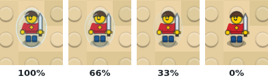

It is deliberately faint. This sits on top of a body you are trying to watch, and a shield you
cannot see through hides the wind-up it exists to survive — the same reason the mace's teeth are
translucent. The **rim** is what you read; the fill is barely there.

The bubble is wrapped around the body the game already models — the same vertical segment every
swing and every projectile is tested against — so it fits a minifig, a golem and a hovering bat
without any of the three being measured by hand.

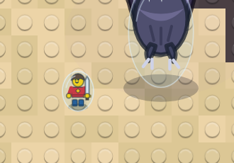

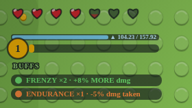


That last line is what makes it a different defence rather than a bigger one. Armour pays you
for every hit you take; a shield pays you for the hits you **don't**. A build that can back out
of a fight for three seconds has a pool that renews all run. A build that stands in the middle of
everything has a pool it spends once.

**Chaos is the answer to it, and a share is enough.** A hit is a mix, not a type — so a swing
half converted to chaos puts *half of itself* past the shield and leaves the other half to be
eaten. You do not need a chaos build to fight a shielded boss; you need some chaos in the build
you have. The same rule runs the other way: a **poison** is chaos over time, so a dose walks
through your own shield while a **burn** meets it.

**Intelligence is the attribute for it** — **+0.2% increased maximum energy shield** per point,
which is PoE's line in this game's units, and the reason the staff's attribute finally buys a
defence. You start with **none**: `WARD BRICK` is what gives you a pool at all, `DEEP WARD`
increases it, and two notables in the blue country (`THE WARDING`, `THE RESERVOIR OF WILL`) are
the tree's way in. A rebuild is never a free heal — picking a card mid-fight raises the ceiling
and leaves what is standing in the bar where it was.

**Six bosses carry one, and the brutes do not.** LORD LAVABRICK and VON BRICKTHANE hit you with
a lump of rock and there is nothing arcane about them; the bone, ash and bat bosses are the ones
the fiction already made strange. The share rides on whatever health the boss ended up with —
after its traits, after the wave modifiers — so nothing else has to know the shield exists.

| | shield | chaos it deals |
|---|--:|--:|
| **VON BRICKTHANE** | — | — |
| **LORD LAVABRICK** | — | — |
| **THE BONE BARON** | 35% | — |
| **THE ASH TYRANT** | 25% | 20% |
| **THE DREAD ROOST** | 30% | 30% |
| **OMEGA BRICKTHANE** | 30% | 15% |
| **MEGA BONE BARON** | 45% | 25% |
| **ULTRA LAVABRICK** | 20% | 35% |

The chaos column is the other half of the same idea: a late boss that deals some chaos is a boss
your *own* shield does not fully answer, which is why the ultras have it and the wave-5 boss
does not.

### One curve, not two

**A wave-45 boss had 8,200 health standing next to a wave-40 ultra's 56,000.** It died before it
finished building itself. The reason was not a number that needed raising — it was that bosses
were written on **two** curves: the ultras climbed 2.3× a tier *with the monster level on top*,
and the bosses between them climbed a flat 420 a tier with **no monster level at all**. Every
other monster in the game multiplies its health by the monster level. These did not.

Two formulas for one idea drift, and these had been drifting for the whole run.

There is one curve now. The ultras read it at whole steps — 1 at wave 10, 2 at wave 20 — and the
ordinary bosses read the **same** curve at the half-steps between, at **half** of it. A wave-15
boss is written as half of what the curve says wave 15 is worth, and it stays half forever
without anybody keeping two formulas in step.

| wave | | pool | share of the ultra before it |
|--:|---|--:|--:|
| 10 | OMEGA BRICKTHANE | 5,700 | |
| 15 | LORD LAVABRICK | 3,100 | ×0.54 |
| 20 | MEGA BONE BARON | 16,900 | |
| 25 | THE DREAD ROOST | 8,200 | ×0.49 |
| 30 | ULTRA LAVABRICK | 24,500 | |
| 35 | THE BONE BARON | 14,600 | ×0.60 |
| 40 | OMEGA BRICKTHANE | 64,700 | |

(Pool is health *plus* shield, averaged over twelve spawns — which of the roster stands up and
what rank it rolls are both dice.)

The ultras stay spikes, which is the half the first repair got wrong: a curve steep enough to
fix wave 45 put a wave-35 boss **above** the wave-30 ultra, and an ultra that is not a wall is
not an ultra. Half is the whole design, in both directions.

### Buffs on the left, ailments on the right

One list of everything bad was already in the corner doing its job. What was missing was the
other half: a hero carrying three charges, a rage well and a fortune had no way to see any of it
except the chevrons over their own head, which say *how many* and never what they are worth.

Two columns now — **BUFFS** on the left, where your eye already goes for your own health bar, and
**AILMENTS** on the right, where the thing happening *to* you belongs. Every row says what the
stack is actually paying (`FRENZY ×3 · +12% MORE dmg`), and a row too long for its pill drops its
extras one at a time rather than running off the end. Both columns are built from data — the
stack table, the curse table, the element list — so a fourth charge arrives in here by existing.

### How big was the hit?

**Three of the five ailments already scaled with the hit and two did not.** A bleed ticks for a
share of the wound that opened it, a burn for a share of the fire that lit it, a poison for a
share of the chaos that landed — hit harder, they hurt more, and that took care of itself.
**CHILL and SHOCK are counters.** A one-damage orbit tick chilled a body exactly as hard as a
mace slam did, which meant the two ailments that most want you to hit hard were the two that
could not tell whether you had.

PoE's rule is that the *magnitude* of a chill or a shock is the hit measured against the body's
life. That is the rule here, in the currency this game already speaks: **the size of the hit
decides how many stacks it lays.**

| the hit, as a share of the body's pool | what it leaves |
|---|---|
| under **1.2%** | nothing at all |
| between | 1 or 2 stacks, scaling |
| **10%** or more | all **3** stacks in one blow |

**A boss's pool is not its life.** A wave-50 boss holds a quarter of a million health; measured
against that, nothing a hero can swing would ever be one per cent of it and bosses would be
flatly immune to two of the five ailments — the opposite of what a storm build wants from the
fight it was built for. A boss's ailment pool is **5%** of its life, so the numbers a late hero
actually deals still read as big hits.

**Three spells still print their own certainty.** Block Freeze exists to chill; a threshold that
could stop it doing so would be a rule eating a spell. Fireball, Block Freeze and Slam of the
Elements always land at least one stack — how many *more* than one still depends on how hard
they hit.

**Increased magnitude** is the stat you buy to make a smaller blow count. It does not change the
ceiling, it changes how fast you reach it — the mace's road, and the slow-heavy build's.

### Exposure — *resistance taken off*

**Not an ailment, and the difference is the whole point.** An ailment is damage or a debuff the
body carries. **EXPOSURE is resistance taken OFF**, which means it sits *outside* your own
increased-damage pool and outside the MORE ceiling with it. A build that has already bought
every increase there is can still get more out of a fire hit by making the body worse at
surviving fire.

> **Solvent** — *+X% chance for a hit to EXPOSE the element it arrived as: −22% of that
> resistance for 6 seconds.*

It is rolled **per element that landed**, so a hit half converted to fire exposes fire at half
the chance — the same share rule every ailment follows. It does **not** stack with itself (a
stacking resistance strip is a hole with no bottom), it *does* stack with the brands a body
earns, and it can drag a resistance below zero, which is a weakness and multiplies up.

Nothing has it until you buy it: `exposeChance` starts at zero, exactly like the one ailment
chance.

### The three charges

PoE's frenzy, power and endurance, and they are the reason the stack table was made abstract
two passes ago: **three whole mechanics arrive as three rows** and nothing else in the file
learns that they exist.

| | earned by | worth, each |
|---|---|---|
| 🟢 **FRENZY** | killing something | +4% attack **and** cast speed, +4% MORE damage |
| 🟣 **POWER** | a critical strike | +30% *increased* critical chance, into the one pool |
| 🟠 **ENDURANCE** | being hit | 5% **less** damage taken, +4% to every elemental resistance |

Three each to start, falling off **one every 4 seconds** — so dropping out of a fight costs you
the ramp gradually instead of all at once.

**Each is earned by doing a different thing,** so which one a build runs on says what that build
does — and a build that does all three gets all three. Like rage, **nobody gains them by
default**: the ceiling is three and the generation is zero until a brick or a node hands it
over. That is what keeps them a build rather than a thing that happens to everyone.

**A generator stops being offered at the bar it fills.** A card that fills a three-deep bar three
at a time has nothing left to sell, and one that fills it *four* at a time is selling you a point
that falls on the floor — but `Set Jaw` had no gate at all and kept turning up for a hero who
could not use another. You may buy up to what the bar holds and not one past it, and **raising
the bar unlocks the card again**, which is exactly the loop those two cards should make together.
The same rule now covers Warpath, Spite and the two that raise a ceiling.

### Six beginnings

**Four weapons is not a symmetrical number.** Red held two doors, green one and blue one, so the
map had a crowded side and a bare one — and every door sat inside a 670px circle round the
middle, which is why the start of the tree read as one tangle rather than six places you could
begin.

Two more doors, one in green and one in blue, and the circle they stand on is pushed out to
**900px**: six doors, two to a country, none of them within **590px** of another. Two of them
are **not finished** — there is no bow and no wand in the game yet — so they are drawn hollow
and dashed, they say so when you hover them, and they carry one short spur each instead of a
full fan. A door that is *coming* is worth more on the map than a gap where one should be: it
tells you the shape of the thing, which is the whole point of a tree you can see all of at once.

**Three ways out of a door, not four.** Every exit from a door inside the ring points outward,
so a fourth was one way out with three spares — twelve nodes inside one 50-degree slice, in the
one part of the map that could least afford them.

**Longer roads with fewer stops.** A road is worth walking when the jump between one decision
and the next is long; six attribute nodes shoulder to shoulder is a queue, and a queue is a toll.
`LANE_STEP` went from **392** to **560** and the cap from five stops to four. The map went from
1,200 nodes to 983 and the median gap between stops is **456px**, so skipping a block of them to
reach something is a real choice.

**And no node prints a number nobody can read.** `+0.04 flat physical damage` is a real 4% on a
weapon whose base is one, and it reads like a rounding error — the *unit* was the problem, not
the value. No tree node prints a raw figure under **0.2** now; where the honest value is smaller
it is sold as a percentage instead, which is the same strength in a unit you can act on. (A card
may still hand over a small flat number: by then you have a built hero to add it to, and the card
says what it does to your actual damage.)

### The card comes to you

Reading a node meant looking away to a panel 900px to the right and then back to find where you
were — twice per node, on a map with a thousand of them. **The card follows the cursor** now, and
flips to the other side rather than running off the edge of the window. The panel keeps what it
is actually good at: what you have spent, and what the tree is giving you.

**And the three country washes are a toggle, off by default.** Three coloured wedges and three
dashed borders across the whole map is a lot of ink for a thing you need to know once. `COUNTRIES`
turns them on, and it is remembered.

### Five more sentences in the tree

Every one of these is a **trade**, and both halves are real. That is the only thing that makes a
keystone worth the walk: a node that is simply good is a big minor node, and the tree already
has plenty of those.

> **The Long Dying** — *what you kill keeps killing, at half the rate.*
> Burns, poisons and wounds spread from a corpse to everything within 120px, at 60% strength.
> **50% LESS damage over time.**

That one is the answer to *"ailment proliferation is too strong to just add"*: it turns three
single-target damage-over-time builds into wave clear in one sentence. It used to cost a quarter
off everything you **hit** — and the build that walks there barely hits, so the price was paid
in a currency it did not spend, and with a 210px spread it was the strongest node on the map.
The spread is a room now, not a screen, and the cost is paid in the thing the build is made of:
half of every burn, wound and dose. A pack melts; a single boss takes twice as long.

(Damage over time had no LESS slot at all before this — nothing in the game could make lingering
damage smaller. `dotRate` multiplies one in now, after the increased pool, the way PoE's keystones
do. And the poison a chaos-converted hit leaves behind goes through `dotRate` like the burn and the
wound beside it: it used to be handed a raw rate, so increased damage over time and increased
chaos never touched it.)

> **Blood and Salt** — *your criticals stop hitting harder and start leaving everything.*
> Every critical inflicts every ailment its damage can. **−55% critical multiplier.**

> **The Overload** — *you cannot crit at all, and everything you do is far bigger.*
> **+32% MORE damage, +25% increased elemental** — and no critical strikes, from any source,
> including the axe's guaranteed backswing.

> **The Deep Cold** — *every chill and shock lands full force, and nothing you leave burns.*
> Ignores the magnitude scale entirely. **−60% increased damage over time.**

> **Unrelenting** — *every charge, by every means — and a body made of glass.*
> All three generations at once, +2 to every ceiling. **−28% maximum hearts.**

And **ten new notables**, spread so that each country gets what it was missing: the three
charges one per country (red takes hits, green kills, blue picks its moment), two exposure
clusters, two about how hard an ailment lands, a shared charge-capacity node, and two filling
plain gaps — red had no node about ending a fight and green had none about surviving one.

### Lightning is yellow

**A damage type has one colour, and everything that deals it uses that colour.** The Storm
Brick did not. It was a **blue** 2×2 with navy studs, throwing **pale blue-white** bolts —
which is the colour this game uses for **COLD** — while the damage number floating off the
body it hit came up in `CONV_COL.shock` yellow. The one spell that only ever deals lightning
was the wrong element on screen.

The brick body, its studs, its charge glow, its spark and the bolt itself all read off
`CONV_COL.shock` now. And the test that checks it does not stop at the colour table: it samples
the **pixels the canvas actually carries** around a hovering brick and along a drawn bolt,
because a palette nothing draws with is a palette that is wrong and passing.

### The options screen

**Two doors, one screen.** `OPTIONS` sits on the title plate next to the music and sound
buttons, and on the pause menu behind `ESC`. It never changes the game's state: a paused run
stays paused underneath it and the title stays a title, which is why the same screen can be
opened from either. `ESC` closes it — and *only* it, so closing the options over a paused run
does not also un-pause the run. Every switch is written to disk the moment you click it.

| switch | what it does |
|---|---|
| **MUSIC** | the field and boss tracks. `M` still takes everything down at once |
| **SOUND** | every hit, pickup, cast and smash |
| **DAMAGE NUMBERS** | the figures that float off a monster when you hit it |
| **START WITH THE COMBAT LOG** | opens the log as a run begins, instead of pressing `L` every time |
| **RESET CHARACTER PROGRESSION** | every tree, every weapon, every difficulty — two clicks |

**DAMAGE NUMBERS turns off the numbers and nothing else.** Everything else that floats off a
body is an *event* worth reading — `FROZEN SOLID`, a curse landing, `LEVEL UP!` — and a player
who wanted a quieter screen in a wave of sixty did not ask to stop being told those. So the
switch sits on the one call the outgoing damage figures make, not on the floater system. The
combat log still counts every point either way.

**RESET takes two clicks** and the second one says `ARE YOU SURE?`. It wipes the skill tree,
best wave, best level, bosses put down, spells mastered and studs banked for **every weapon on
every difficulty** — "my character" is all of them, and half a wipe is worse than none. What it
does *not* touch is your settings: a preference is not progress.

### Every ailment, one rule

**An ailment is a property of the damage TYPE, not of the spell that threw it.** That was true
of exactly one of the five. The rest were each written into their own call site, and what you
got was arbitrary:

| | before | now |
|---|---|---|
| **SHOCK** | only off the Storm Brick, from a chance called *"chance for a storm bolt to SHOCK"* | any hit that lands as lightning |
| **IGNITE** | only off the staff's bolt and the ember | any hit that lands as fire |
| **CHILL** | only off Block Freeze | any hit that lands as cold |
| **BLEED** | only off a *melee* source, so a physical spell never opened one | any **attack** that lands as physical |
| **POISON** | rolled off how much of the hit arrived as chaos, wherever it came from | unchanged — this one was always right |

A hero who had converted a whole build into lightning could not shock anything with any of it.
Now every one of them is poison's rule: the chance rides on the share of the hit that arrived
as that type, and the ailment lands on the part of the damage that actually *was* that type.

#### What you start with is nothing

| damage type | ailment | base chance | on a critical |
|---|---|---|---|
| 🩸 Physical | BLEED | 0% | 0% — *and attacks only* |
| 🔥 Fire | IGNITE | 0% | **100%** |
| ❄️ Cold | CHILL | 0% | **100%** |
| ⚡ Lightning | SHOCK | 0% | **100%** |
| ☠️ Chaos | POISON | 0% | 0% |

Every base chance is zero. Chaos used to carry a free **35%** dose, which made it the one
damage type that never had to pay for its ailment — it pays now. What turns any of them on is
**Afflict**: one stat, added to all five, capped at **75%**. Because it is one stat it works on
whatever your damage has *become*, which is the whole point.

**What a critical buys is the three ELEMENTS, and only those.** A fire crit always ignites, a
cold crit always chills, a lightning crit always shocks. It does **not** open a wound and it
does **not** leave a dose: BLEED and POISON are bought, or they do not happen. A crit used to
carry its own 50% bleed, which quietly made the crit tree the bleed tree as well.

**BLEED is the only one that cares where the hit came from.** It is an *attack* ailment: a
swing, its whirl, the vortex, bladestorm's blades and the slam can cut. An orbiting brick that
has bought physical damage still hits for physical — it just does not cut.

**Three spells carry their own chance on top of the table,** the way a PoE gem does, and it
is written on the character sheet rather than hidden in the code. **Fireball** ignites **25%**
of the time on its own — PoE's Fireball number — and that *adds* to whatever Afflict you
have bought, so ailment bricks are worth something to a staff for the first time; a fire
critical still always ignites. It used to be 100%, which made "chance to ignite" a card a
staff never wanted. **Block Freeze** always chills (Absolute Zero upgrades that chill into a
stun, so without it the legendary would do nothing), and **Slam of the Elements** leaves all
three. The **embers** Ember Scatter throws keep their certainty too — they only fly off a body
that is already burning, and "sets the next one alight" is the whole card. Nothing else
carries a chance of its own — not the storm brick, and not a converted swing.

A weapon still bleeds like itself: an axe cuts clean at **×0.45**, a mace mangles at **×1.9**.

#### The bug this fixes

> *"I play with axe now and 50% of my physical damage is converted to fire — why don't I ignite
> the boss when I'm hitting him?"*

Because the chance was **zero**. An axe swing reports as a weapon source, not as a fireball, so
it got `AIL_BASE.fire` (0) + `AIL_CRIT.fire` (0) + whatever Afflict you had bought (0) — nothing,
at any conversion. Now that same axe ignites on every crit, on the fire half of the hit, and at
your bought chance the rest of the time. Half the hit, half the chance.

### An ailment belongs to what landed

**Convert every point of your fire into chaos and your fireball sets nothing alight.** This
is the half of conversion that is easy to forget to write, and for a while it was missing:
the bolt called for an ignite because it was a *fireball*, not because any fire had actually
arrived — and a burn ticks as **fire**, down a path that deliberately skips the pipeline so
a wound is not re-converted on every tick. A build that had converted all of its fire away
was still dealing fire.

Every ailment now rides on the share of the hit that actually arrived as its type, which is
the rule the chaos poison always followed:

| | |
|---|---|
| **Ignite** | the fire that landed — half converted is half the burn, all converted is none |
| **Chill / freeze** | the cold that landed |
| **Shock** | the lightning that landed |
| **Bleed** | the **physical** that landed — a swing converted entirely to fire opens no wound |
| **Poison** | the chaos that landed (this one was always right) |

A magnitude simply scales. A count of *stacks* cannot be fractional, so the remainder is
rolled — half a chill is one chill half the time, which is unbiased and does not quietly
round a 40% conversion away to nothing.

### Chaos

**Neither physical nor elemental**, and the rules follow from exactly that:

- **Armour never stops it.** Armour is a physical mitigation and chaos is not physical.
- **It has a resistance of its own**, and almost nothing in the roster carries any — but it
  *is* a resistance, not a hole in the rules.
- **Nothing that says "to every elemental resistance" covers it.** Not a brick, not a tree
  node, and not a curse that sunders your elemental resistances either. Chaos resistance is
  bought on its own or not at all.
- **It pays its own increase pool.** Increased elemental damage does nothing for it.
- **Poison is chaos damage over time**, the way bleed is physical over time and burn is fire.
  It reads increased chaos damage as well as increased damage over time, it pays the
  monster's chaos resistance, and the dose *you* are carrying is reduced by yours.
- **A hit carrying chaos can leave a dose behind**, on odds that ride on how much of the hit
  actually was chaos — the way physical can open a bleed.

Which makes chaos the answer to a monster that resists everything else, and chaos resistance
the answer to a blightspitter.

**The character sheet grows a CONVERSION card** the moment you convert anything — one row
per type showing what share of an ordinary hit arrives as it and what it meets on the way in,
plus the multiplier conversion puts on the size of the hit. It reads the *same* split the hit
itself reads, so if the card and the monster ever disagree you can see which one is lying.
The exhaustive EVERY STAT list below it carries the same five rows, always.

`conv.js` proves the pipeline on its own — an uphill pair is refused, a hero with no table is
the safest path through rather than the one that throws, and the worst case (every legal
conversion *and* every gain-as-extra at once) terminates in under a millisecond.
`conv2.js` puts a hero in front of a monster and measures what actually comes off its health
bar: armour walked past, the right resistance paid, half-converted is half-mitigated, a real
swing arriving at exactly `base × every pool that should apply to it`, gain-as-extra leaving
the source alone, chaos resisted by nothing, chaos leaving doses, a drain **not** re-converted,
and the sheet agreeing with the hit. Sixteen break-builds between them, each caught by the
assertion meant for it.

---

## The main menu

**Every stat, and which layer put it there.** The left panel used to show nine opening
numbers and a percentage against "no favourite", which answered one question out of three: a
hero is a **bare hand + a weapon + a favourite + a skill tree**, and the tree was invisible on
this screen entirely.

Four heroes are now stood up from scratch and **every probe on the character sheet** is read
off each of them. The difference between one layer and the next *is* that layer's
contribution, printed beside the finished number as a chip:

> **Bolt damage 3.18** `W+2.64` `T+0.54`

Nothing is estimated, nothing is duplicated, and a stat nobody has thought of yet appears on
this panel the moment somebody adds a probe for it. The panel scrolls, its group headings
stick while it does, and every row explains itself on hover.

> **No Favourite is a favourite.** It hands out +5% increased damage, a heart, ten armour and
> more — so a "weapon only" layer that quietly applied it made every real favourite look like
> it *cost* you five per cent. Which it does, and which is exactly what the `F` chip should
> say out loud rather than hide inside the `W` one.

**ABILITIES, not ability floors.** The panel lists what you actually open with — your weapon's
attack and every spell your favourite grants — with its damage beside it, and hovering one
opens its full damage panel. The floors moved down into CEILINGS where they belong.

**The sword is not the yardstick any more.** Hovering it used to show nothing at all, because
every weapon was written against it. Everything is written against **BARE HANDS** now — a
level-1 hero holding nothing, every multiplier 1 and every defensive perk zero — so the sword
reads −32% swing time, +40% reach, +50% crit multiplier and +40% less damage taken like any
other choice.

And the tooltips **fit**. An absolutely positioned tip anchored above its row has no idea
where the top of the window is, so the mace's and the staff's ran off the screen. They use the
same fixed, viewport-clamped element the stat rows use, drop below the row when there is no
room above, and scroll when the window is shorter than they are.

**The skill tree button says which number it is showing, and whose.** It printed points
*left*, so a hero who had spent all twelve read `SKILL TREE — 0 POINTS` — identical to one who
had never earned any. And it was refreshed when the **difficulty** changed but not when the
**weapon** did, so it went on showing the last weapon's count. Twelve trees, one label, and no
way to tell them apart. It now reads `SKILL TREE — 4 TO PLACE · 15 spent · STAFF · HARD`.

### The short list

**The menu opens on twelve numbers, not a hundred and seventy-five.** It was handing a new
player every stat in the game — burning rows for a sword, ceilings nobody reaches for an
hour. It opens on **YOUR STATS** now: how hard, how often, how tough, how fast, under four
plain headings, and only the ones this hero actually *has* — a sword is not shown its bolt
damage as a dash, it is simply not shown it.

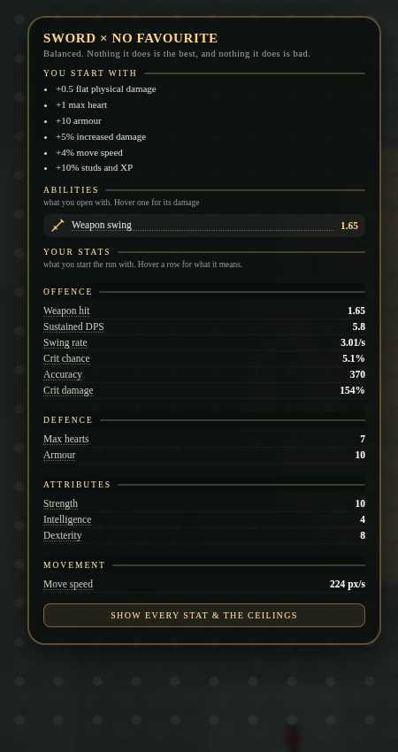

**SHOW EVERY STAT & THE CEILINGS** at the bottom is the whole panel, exactly as it was, layer
chips and all. It is remembered, so a player who wants the lot asks once.

The short list is not a second list. A probe carries a `basic` field naming the heading it
sits under, and both short views — this one and the character sheet's — filter on it, so the
short view and the long one can never disagree about a number: they are the same row, and one
of them shows fewer.

### Breach

The first league mechanic. From **wave 6**, an ordinary (non-boss) wave has a **45%** chance to
carry a **Breach hand** — and never more than two ordinary waves go by without one. A few
seconds into the fight a clawed fist of void bricks pushes up through the floor 380–760px away,
with a marker on the screen's edge while it is out of sight.

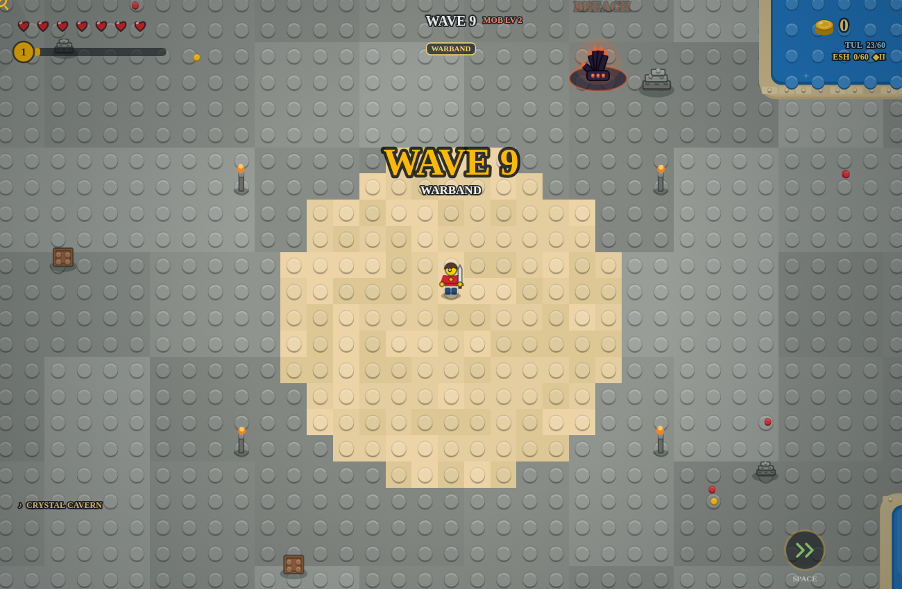

**Walk into it and it opens** — and a breach is not a spawner, it is **another layer of the same
ground**. The moment it opens, the whole map is filled with one **Breach Lord**'s monsters —
**600 of them on the first breach wave, forty more every wave after, 2,000 at most** — standing in
packs of three to six where they stand, and none of them exists for you until the circle reaches
them. The circle grows at 110px a second and keeps growing, **all the way to the
far corners of the map** if you can keep it open. Inside it they are there; outside it they are
not — not drawn, not hittable — and a breach body cannot walk out of its own circle. They are
bodies you already know, re-cast in the lord's colours, 30% softer, hitting with its element.

| lord | | swarm hits with | the ring (per rank, up to V) |
|---|---|---|---|
| **Xoph**, Dark Embers | 🟧 | fire | gain 5% of physical as extra fire · 12% increased fire · +6% fire res |
| **Tul**, Creeping Avalanche | 🟦 | cold | the same, in cold |
| **Esh**, Forked Thought | 🟨 | lightning | the same, in lightning |
| **Uul-Netol**, Unburdened Flesh | 🟫 | harder physical | 15% increased physical · +40 armour |
| **Chayula**, Who Dreamt | 🟪 | chaos | gain 5% as extra chaos · 12% increased chaos · +8% chaos res · +3 energy shield |

**It is on a clock, and every breach monster you kill buys some of it back — by less the wider
the circle is.** Eight seconds with nothing killed, never more than twelve on the clock. A kill
is worth **0.7s** while the circle is small, then shrinks as it grows: 0.29s at 500px, 0.12s at
1000, 0.05s at 2000. The same kills that held a small breach open barely hold a big one, so
keeping a wide breach open means killing a great many more. **When the clock runs out, the ring
falls back in** as in PoE — over a second to four and a half, by how wide it had grown — and a
breach body is gone only when the edge passes over it, pulled back through, paying nothing; until
then it is still in the fight. The wave cannot end while a breach is open.

**The further out, the more of them.** Three in ten of the layer are packed round the hand, so a
small circle has something to fight at once; the rest are laid thicker the further they are from
it, so the wider the ring, the more of them its rim meets every second — between 2,000 and 2,500px
it meets two to three times as many as between 500 and 1,000. How many can stand revealed at once
widens with it too: 90 in a small circle, up to 180 across the map. The layer is finite, so there
is no build that holds a breach open forever.

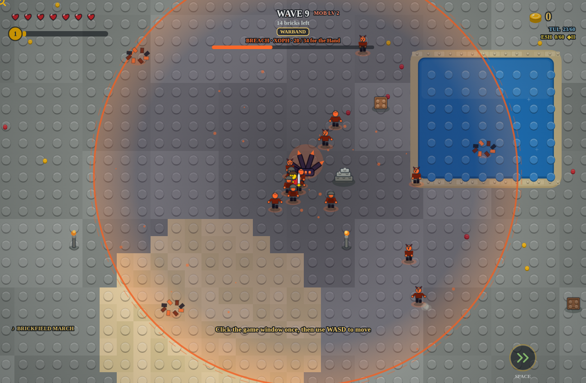

**What it pays is splinters.** One a body, three from a magic one. **Sixty of a lord's
splinters fuse into a breachstone**, and a breachstone is that lord's ring — or one rank deeper
into the ring you already wear. Kill **34** in one breach and **the Hand of the Lord** steps
through beside you: an elite at about a quarter of a boss's health, which holds the breach open while it
stands (up to 20s) and drops the ring outright, plus fifteen splinters.

**Past rank III — the deep breach.**

- **Blessed ranks.** Rings go on to **IV and V**, the blessings: a breachstone for IV costs **100**
  splinters, for V **150**. A ring at V turns every further stone into a **Blessed Hoard** (an
  uncommon chest).
- **The Breach Hoard.** When the ring has fallen all the way in, it leaves a chest at the hand,
  painted by how deep the breach was fought — kills inside, plus 60 if the Hand fell: 25 for
  common, 60 uncommon, 110 rare. **A breach chest never comes above rare**: a breach pays in
  rings and splinters, not in bricks.
- **The Breachlord.** With a lord's ring at rank III or better, a breach of that lord fought past
  the Hand to **110 kills** calls **the lord itself** through: a giant revenant in its colours
  with fourteen times the health of its kind, which holds the breach open while it stands (up to
  35s). It pays forty splinters and a rank of its ring, and **its breach's hoard is rare** — the best a breach gives.
- **Deeper every time.** Every breach opened in a run makes the next one harder: its bodies
  12% tougher per breach before it (to three times), and more of its packs magic.

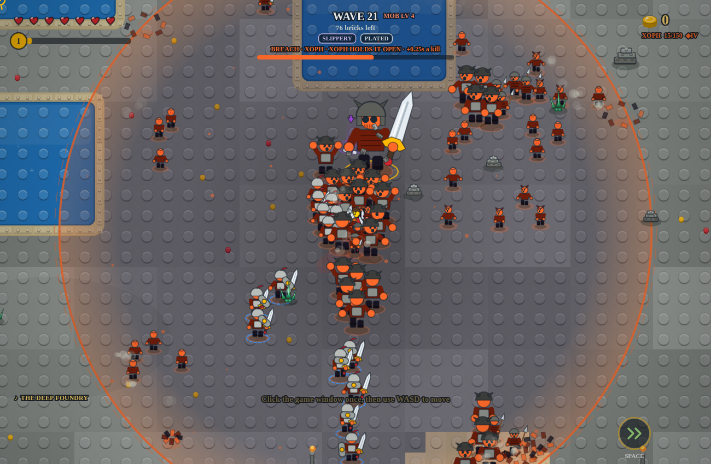

Splinter counts sit top-right under your studs, against what the next rank costs, only for the
lords you have met; the character sheet grows a **BREACH** block with each ring's rank and what it
is giving you. The breach bar shows its depth and what it is counting towards — the Hand, then
the Breachlord.

### Abyss

From **wave 3**, on any wave that is not a boss wave, there is a **35%** chance (and never four
ordinary waves in a row without one) that an **ABYSS** cracks the floor open a few seconds into
the fight: a jagged hairline across the arena, 1,500–1,700px long, with a **green eye** at its
head. The eye is pinned to the screen's edge like a chest until you find it.

- **Walk onto the eye and it opens** — and it keeps opening, down its length at 95px a second,
  **only while you follow it**: stay within 380px of its front. Walk away and it stops; leave it
  stopped for **18 seconds** and it **seals**, paying nothing.
- **Monsters climb out of it** behind the front, a pack of two to four every 110px — imps,
  zombies and skeletons early, stalkers and bats from wave 7, runners and knights from 12, hulks
  and revenants from 18 — in black with glowing green hands, and a green stain under them.
- **Two abyssal pits** tear open along it, a third and two thirds of the way down. Each spills a
  pack of six to nine (one of them magic), and **the crack goes no further until the pit's pack
  is dead**. A cleared pit pays a spray of studs and, 40% of the time, a common or uncommon chest.
- **The Stygian.** At the end of the crack a champion climbs out — an elite skeleton, brute or
  revenant by the wave, with six times the life. Its fall **clears the abyss**: a chest at the
  depth (rare 40% of the time, uncommon otherwise — like a breach, an abyss chest is **never
  above rare**) and a shower of studs.
- **An open abyss holds the wave**, the way an open breach does. An abyss you never touched simply
  closes when the wave ends.

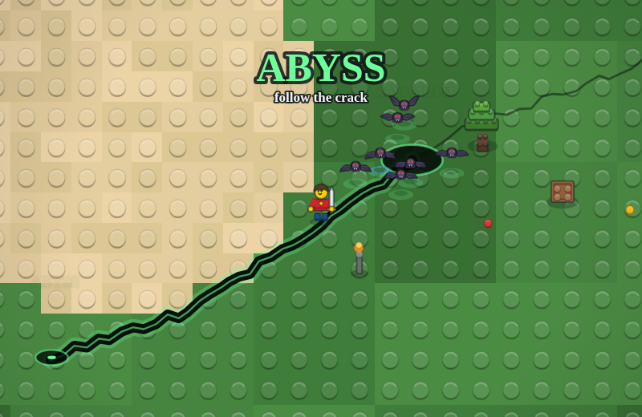

### A run, as a link

**COPY RUN LINK** sits in the pause menu and on the death screen. It copies an address that holds
the whole run: weapon, difficulty, favourite, the map's seed and the roster's shuffle, the tree as
it stood, every brick in the order you took it at the rarity it rolled, your level, rings,
splinters and golden hearts. Open the link and that run starts again **at the start of the wave
you copied it on**, the hero rebuilt brick by brick — number for number the same hero, on the same
map. It is for looking at a death, a build that melts a wave too fast, or a bug; share it and
someone else sees exactly what you had. A linked run is a replay: it banks nothing to your tree.
**TRY AGAIN** replays the link from its wave; **TITLE** lets go of it.

### Block

A monster **carrying a shield** can block. The knight is the one that does: **50%** of hits on its
shield side are stopped outright, `BLOCKED`. A shield covers one side — hits from behind always
land — a bomb goes over it, and a spin comes round it. Nothing without a shield ever blocks. It
used to be a certainty: a knight facing you stopped every arrow ever loosed, which made it a wall
for a bow. The bestiary lists the block chance.

### Monsters strike

A monster no longer hurts whatever it happens to be standing on. Every melee monster walks up to
the edge of its target, **raises its weapon for about a third of a second** (longer on the slow
ones), and **swings**: a white arc shows where the blow went, and it lands only if you are still
in front of it and within reach when it comes down. Step out during the wind-up and it misses.
Lancers still lunge, and the lunge is the hit; ranged monsters still shoot and cast. Nothing
walks into your middle any more — a body pushed into you steps back out to your edge, and one
pushed into a skeleton shares the step with it. Monsters carry what they fight with: the
crypt's skeletons and revenants a blade, knights a sword behind the shield, archers and
marksmen their bow even while they walk, casters their staff. **Knights** hold off behind the
shield between blows and step in to strike whenever the sword is ready — before, they held off
forever and never hit anything.

### The scepter

The last door on the tree, intelligence's second weapon, and a summoner in the PoE mould. **The
hero hits nothing.** The scepter carries a **SUMMON AURA**: it raises skeletons out of the floor
where your cursor points, one a raising at the scepter's rate (0.70s, sped by attack speed), until
the legion is full — four to begin with — and whenever one falls, the aura stands another. They
walk to whatever is near you and cut it down.

**Left click is CONVOCATION** — PoE's gem, built in: every minion you own (skeletons, golems and
zombies) is called back to your side **one by one, nearest first, 0.14s apart** — you watch the
legion answer — and each **regenerates 25% of its life a second for 3s** as it lands. A 3s
cooldown; the ability row shows it as **CALL**, the ring filling as it comes back. A raising always lands on floor: point into a lake or at a boulder
and the skeleton climbs out of the nearest ground you could stand on, and skeletons walk round
water and rocks the way you do.

- **An even legion.** What rises is whichever of **spearman** (×1.25 the scepter's hit),
  **swordsman** (×1.35 — shorter reach, a quicker blow) and **bone archer** (×0.9, shoots from
  **480px**) the legion has fewest of, a tie broken at random: nine skeletons are always three of
  each. With Skeleton Mages every one is a mage.
- **The back line moves.** Archers do not plant their feet: in range, each keeps a spot in a
  loose arc on your side of the fight and picks a fresh one every second or so, shooting as it
  goes; anything that gets inside its comfort, it steps back from.
- **Only their own kind is in the way.** Skeletons keep room from skeletons, golems from golems
  and zombies from zombies — but a skeleton walks straight through a zombie or a golem, and a
  golem through a skeleton, so the three pools never jam each other up.
- **Mages never move.** A skeleton mage rises on a spot of its own and stays there: it does not
  walk, it does not blink, a skeleton or a monster leaning on it cannot shove it, and it is not
  pulled back when you walk away. It throws at whatever is in reach from where it stands —
  **Convocation** is how you bring your mages with you. It reaches **820px**
  (and fights that far from you), and its bolts fly at 960px/s for about 1,070px, fanned much
  wider than an archer's — up to 160° with a full volley.
- **Greater Multiple Projectiles.** An archer's arrow and a mage's bolt become a **fan**:
  **Bone Volley** adds one to three by rarity (uncommon +1, rare +2, epic +3), eight in all;
  **Greater Multiple Projectiles** (legendary, once) adds four for **25% LESS** projectile damage;
  the tree's *Bone Rain* adds two. All of it together is **15 a shot**. The fan widens with the
  count (an archer's to about 85°, a mage's to 160°), so a body far off takes one or two and a
  body close enough to stand in the middle of it takes many.
- **The aura never recycles.** A full legion stays standing: the aura only fills empty places,
  and never breaks a skeleton to make room. A dead hero raises nothing.
- **You first.** A skeleton goes for whatever is nearest *you* within 260px; only with nothing
  near you does it take the nearest to itself — never more than 560px from you. With nothing to
  fight it breaks the nearest **chest or crate**, since a summoner has no other way to open one.
- **They are you, to a monster.** A monster goes for whichever is nearer, you or a skeleton, and
  fights it exactly as it would fight you: the swordsman swings at it, the archer shoots it, the
  lancer lunges at it. And **every enemy ability lands on skeletons** as it lands on you: rings
  and shockwaves, the boss's yellow ring and its mace sweep, spikes, fire, venom and storm pools,
  lobbed bricks and fireballs, bombers, thorns, and every missile — the first skeleton an arrow
  crosses takes it.
- **Three epics, and only epics.** **Bone Golem** (up to **five** times): one more golem rises at
  your side — 3.5× a skeleton's life, 2.75× the scepter's hit, and every blow a slam that lands on
  everything in front of it. **Golems are their own pool**: they take no place in the legion, so a
  full summoner stands **5 golems and 15 skeletons**. A golem that falls rises again 10s later. **Bone Overseer** (once): a staff-bearing lord
  rises at your shoulder and does not fight; every minion within 320px of it deals **30% MORE**
  damage and attacks 25% faster. It is not one of the legion and rises again 15s after it falls.
  **Raise Zombie** (once): see [the graveyard](#raise-zombie--the-graveyard) below.
- **A minion's numbers are its own.** A skeleton hits for (the scepter's **2.10** + minion flat)
  × (1 + your level pool + the minion pool) × its kind. Nothing you buy for your own hits reaches
  it, and your conversions do not either. Its life is 14, plus 12% for every hero level, times the
  minion life pool. They never leave you: nothing more than 560px from you is theirs to chase, and
  a skeleton that is lost rises again at your side.
- **Bone finds the gaps.** Armour is weighed against the size of the blow, so it is hardest on
  many small hits — which is what a legion is. Every minion hit **ignores half the armour** in
  front of it.
- **Bricks:** Bone Legion (+1 to +3 skeletons by rarity, to 15), Grim Feast (minion damage), Bone
  Armour (minion life), Quickened Bones (minion speed), Sharpened Bones (flat), Twin Raising (+1
  a raising at rare, +2 at epic, up to **five a raising**), Bone Volley (+1 to +3 projectiles).
- **The legion, counted.** A skull badge in the ability row shows how many stand of how many may
  (**LEGION 5/7**), its ring filling as the legion does, with a second badge for the golems
  (**GOLEMS 2/3**); the buff list spells it out: how many spears, swords, archers, golems, and
  whether the overseer is up.
- **Skeleton Mages**, the legendary: every skeleton becomes a caster that stands off out of
  reach and throws fast bolts, a third of the legion each in **fire, cold and lightning**, for 80%
  of a blade's hit. Every bolt is its element and leaves its element's ailment.
- **Necromancer** is its favourite: +1 skeleton, +15% minion damage, +20% minion life, and twelve
  intelligence.

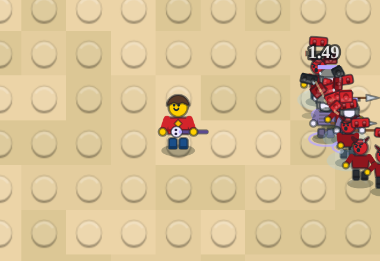
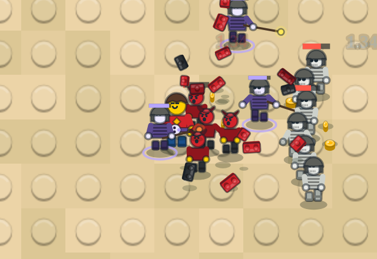
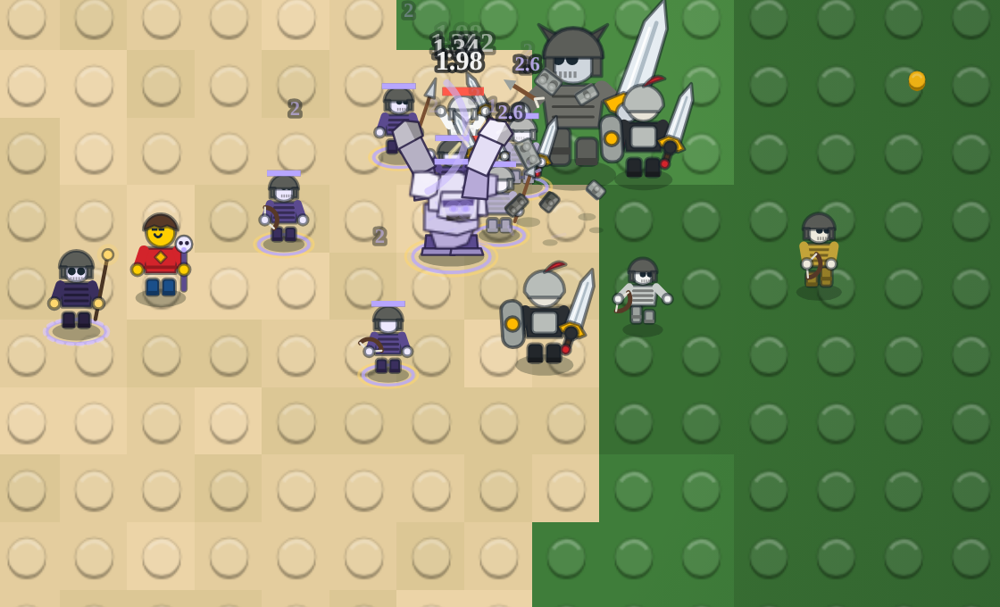
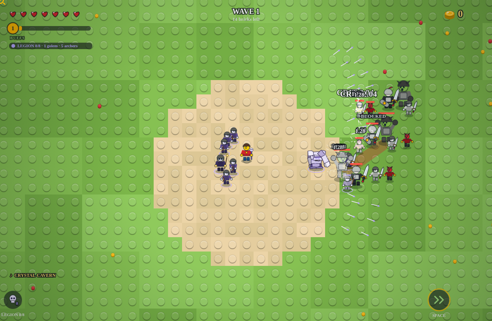

#### Raise Zombie — the graveyard

[Zombies](#the-dead-that-walk) leave a **corpse** when they die — and only a summoner sees it: for
any other weapon nothing is laid at all. A corpse lies for **30s** (it fades out over the last
three) with a faint violet ring round it: *this one could stand up for you.*

Take **Raise Zombie** — the notable of **THE GRAVEYARD** on the tree (intelligence's country, with
+8% minion life), or the same thing as an **epic** brick — and the summon aura also raises
**zombies** from those corpses: the corpse nearest your cursor, within **700px** of you, one a
raising on the aura's clock, up to **twelve**. Zombies are **their own pool** — they take no place
in the legion or among the golems, so a full summoner stands 15 skeletons, 5 golems and 12
zombies. A zombie is a slow, sturdy brawler: 2.2× a skeleton's life, 70% of its speed, and hands
that hit for 1.15× the scepter's base. They take every minion stat you have, answer Convocation,
and count on their own badge (**ZOMBIES 7/12**) beside the legion's.

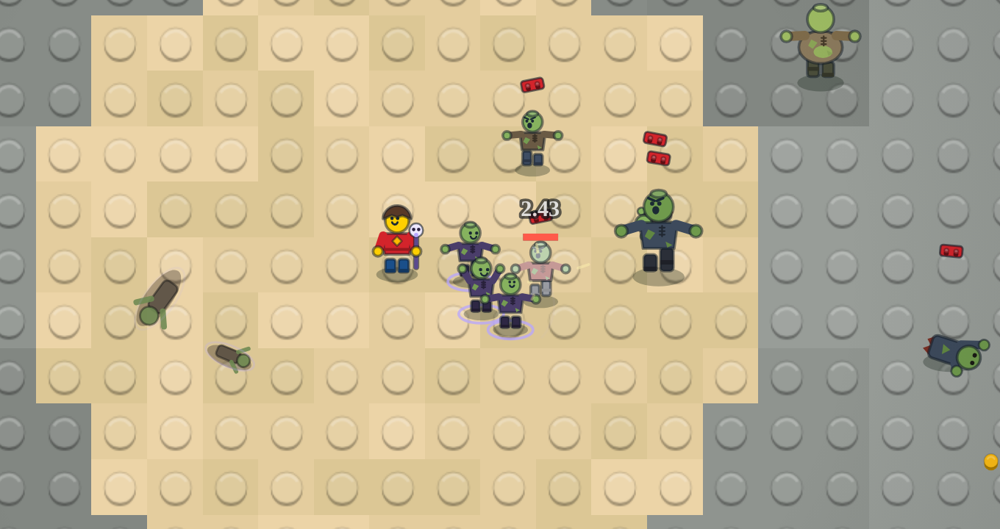

**On the tree:** the scepter's door opens into minion damage, minion life, minion speed and
energy-shield lanes. **THE OSSUARY**'s notable *Lord of Bones* adds a skeleton. Intelligence's
spell country carries minion nodes too — **BONEWORK** and **GRAVECALL** (minion damage, life and
speed), the notable cluster **THE CRYPT** (*Crypt Keeper*: +15% minion life, +6% minion speed) and
**THE VOLLEY** (*Bone Rain*: +2 minion projectiles, +6% minion damage). And **every small node in
blue feeds the legion as well**: spell and elemental damage carry 80% of themselves as minion
damage (60% for a single element), cast speed as minion attack speed, energy shield and
resistances as minion life. The second line is scepter-only, so to every other weapon the node is
what it always was — and a summoner can walk the whole of intelligence's country without leaving
the legion behind. And two keystones:

> **Mirrored Legion** — *your legion fights the way you do.* Your minions gain **three quarters
> of your own increased damage** — physical, elemental and spell — and **your conversions**, on
> every hit they make. You deal **40% LESS damage** yourself. Build yourself and your army
> follows; the price is the hits you still throw with your spells.

> **Minion Instability** — *what falls, burns.* A skeleton that dies **bursts**, dealing 30% of
> its life as fire to everything within 110px. 15% LESS minion damage.

### The bow

A dexterity weapon, and the fifth door on the tree. It does not swing: the attack button looses
an **arrow** — physical, it bleeds, it rolls to hit against evasion like any attack, and it
flies until something stops it. It carries **+120 evasion** and ×1.25 accuracy and none of the
melee kit: no reach, no spin, no lifesteal, no armour, and the swing-only bricks (reach,
Bladestorm, Blade Vortex, Blademaster, leech) are never offered to it. Its own bricks:

- **Split Arrow** — +1 arrow a shot at uncommon, +2 at rare, +3 at epic; fanned, up to 9.
- **Piercing Shot** — +1 pierce at common, +2 uncommon, +3 rare, +4 epic, up to 12; each body an
  arrow has gone through costs it 15%.
- **Barbed Arrows** — flat physical to arrows only.

**An arrow shoots things down.** Cross a monster's shot — an arrow, a skull, a bolt, a frost
bolt, a hex, a bat — and both are gone: the arrow is spent taking it out of the air. A thrown
boulder is the one thing it cannot stop; the arrow breaks on it and the boulder keeps coming.
**It breaks things too:** crates, trees, rocks, cacti and chests take one knock an arrow, the
same as a swing, and the arrow stops in them — so a bow opens a chest from across the field.

**One arrow legendary a run.** The three are exclusive; taking one closes the others.

| | converts | ailment | at the body |
|---|---|---|---|
| **Lightning Arrow** | 75% physical → lightning | +25% shock | forks to the **4** nearest bodies within 190px, 50% each, once and never onward |
| **Fire Arrow** | 80% physical → fire | +20% ignite | bursts: everything within 80px takes the arrow **45% less** |
| **Chaos Arrow** | 75% physical → chaos | +25% poison | pierces **every** body in its line, unworn |

The arrow converts **first**, the way a PoE skill gem does: its share comes off the top, and
your own conversion shares out what is left — Lightning Arrow on a hero with 50% physical to
fire is 75% lightning, 12.5% fire, 12.5% physical. Nothing but an arrow ever reads the
arrow's table, so the rest of your kit is untouched.

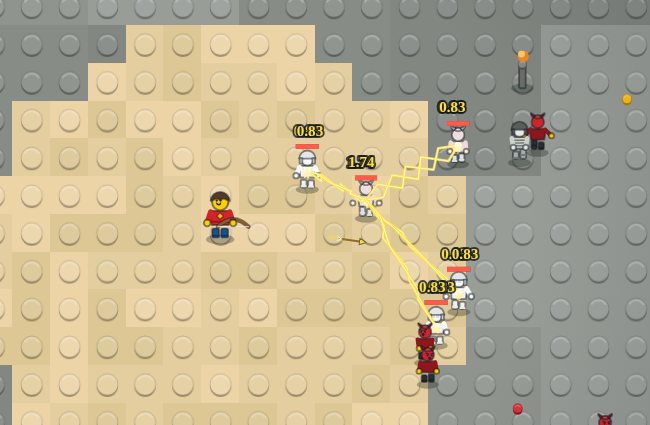
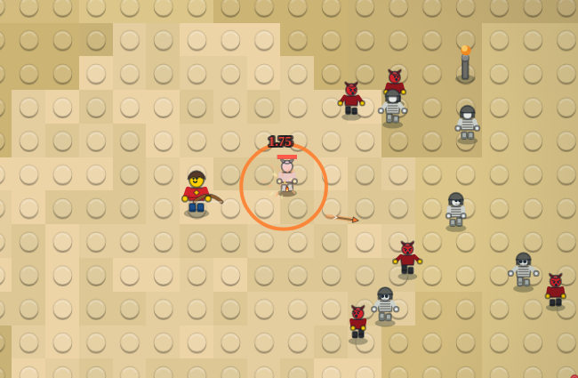

**Deadeye** is the bow's favourite: +1 pierce, +10% attack speed, +60 accuracy and twelve
dexterity. On the tree, the bow's door opens into draw, nock, sight and light-step lanes, THE
BARREL is arrows now, and **THE RICOCHET** keystone in dexterity's country reads:

> **Ricochet** — *40% chance for an arrow that would stop to leap to the nearest body it has
> not hit, up to twice · 15% LESS arrow damage.*

**The Brick Blaster is gone.** It was a physical projectile spell that fitted nothing; its
flight code, pierce falloff and cards are the arrow's now.

### The shield's three endings

Three keystones on the rim of intelligence's country, straight out of PoE — each a trade only a
shield build wins:

> **Chaos Inoculation** — *one heart, a far deeper shield, and chaos cannot touch you.*
> Maximum hearts become **1**. Every heart you gave up comes back as **2 energy shield**, before
> the increases, so every increased-shield card multiplies it too. The chaos part of any hit does
> not arrive; a dose never takes hold.

> **Ghost Reaver** — *what you steal becomes your shield, never your blood.*
> Lifesteal fills the energy shield instead of the hearts.

> **Zealot's Oath** — *what mends you mends your shield, never your hearts.*
> Regeneration fills the energy shield instead of the hearts — without waiting for the recharge
> clock, because it is regeneration and not recharge.

Chaos is the damage type that walks past a shield; CI is the answer that makes you immune to
it. The other two cost exactly what they redirect: with no shield to fill, they are a leech or a
regen thrown away.

### The guardian guards

Tidal Orbit made the ring breathe in and out — a different way of dealing the same damage. The
two legendaries that replace it change what the ring is **for**:

- **Aegis Ring** — every brick in the ring **stops one hostile projectile** that crosses it:
  arrows, bolts, skulls, hexes, a thrown boulder. The brick breaks doing it and rebuilds itself
  **2.4s** later, and while it is rebuilding it neither blocks nor strikes. Brick count and spin
  speed become defence: more bricks is a thicker wall, a faster spin sweeps more of the circle.
- **Twin Ring** — needs the Aegis. A second ring of as many bricks, in gold, turning **the other
  way**, far enough out that the two can never touch, and blocking too. Its bricks strike on their
  own clock, so a body caught across both rings is hit by both.

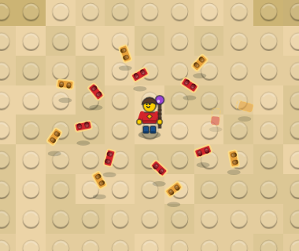

Measured on an 80-arrow volley from every direction: a bare hero takes all of it, the Aegis stops
about 22 of them and the Twin Ring about 45. One ring runs out of bricks partway through a volley
that long — each rebuilds 2.4s after it breaks — which is exactly what the second ring is for.

### Every hand carries attributes

Every favourite hands over **twelve attribute points**, split by what the hand is — the same
twelve for all of them, so no hand is ahead on attributes alone; what differs is which defence
and which damage line they feed:

| hand | STR | DEX | INT |
|---|--:|--:|--:|
| No Favourite | 4 | 4 | 4 |
| Sword & Steel | 8 | 4 | |
| Reaver's Edge | 4 | 8 | |
| Earthshaker · Tough Bricks | 12 | | |
| Guardian Brick | 6 | | 6 |
| Brickbane | | 8 | 4 |
| Deadeye | | 12 | |
| Necromancer | | | 12 |
| Storm Brick | | 4 | 8 |
| Bladestorm | 4 | 8 | |
| Blade Vortex | 6 | 6 | |
| Block Freeze · Elemental Arts | | | 12 |
| Bomb Volley | | 6 | 6 |

The split is data on the card and the hover line is printed from it, so the two cannot drift.

### Reduced and less

PoE never writes "−25% increased" or "−20% more". A negative increase is **reduced**, a negative
more is **less**, and the minus sign goes because the word carries it. This game printed the
sign — a keystone read "−25% increased damage" — because eighty-odd texts build "N% increased"
from a number that is usually positive. Rather than audit eighty sites and miss one, the rule is
applied once, where text leaves for the screen: the page's escaper, every character-sheet row,
the tree's mod text and the reward card. A label beside its value flips too — *Reduced melee 25%*,
*Less damage ×0.80* — and a stat named for its cost reads the PoE way: *50% LESS damage over
time*, no plus. A range like "10–20% increased" is left alone.

### The weapon card stands beside its button

Hovering a weapon shows a card taller than the gap above or below a button in the middle of
the menu, so the old above-or-below rule clamped it straight down **on top of** the button —
the card covered its own label and the pointer that summoned it. It stands to the right of the
button now (to the left for the rightmost one, where the window runs out), level with it, at
exactly the same size.

**`Ember Core` was never a fire card.** `flatElem` is read by the bolt, by Block Freeze and by
the Storm Brick alike, so it has always been the single best upgrade a frost build can take —
and it was called Ember Core, wore a flame, and said *"to your fire bolt"*. Being handed an
ember after picking Block Freeze as your favourite was a card lying about itself, not a bad
roll. It is **`Elemental Core`** now and says what it feeds.

---

## Sound

**Music and sound are separate switches, both on the menu, both remembered.** `M` still
takes everything down at once — which is what you want when somebody walks into the room,
and useless when it is only the music you are tired of. The buttons say `MUSIC: OFF` the
moment `M` mutes, so the menu never disagrees with what you can hear.

A silent channel **builds no voices**: turning the music off stops the scheduler rather than
turning its volume down, and the scheduler's clock is caught up when it comes back — otherwise
ten silent minutes return as ten minutes of notes at once.

**`STUD OVERDRIVE` is gone.** 150 bpm, a square-wave lead and a hat on every sixteenth, and
it played for every wave from fifteen to the end of the run; ten minutes of it was exhausting.
**`THE DEEP FOUNDRY`** takes its place and makes the opposite bet: 116 bpm, slower than the
track before it, a descending D-minor walk under a lead that leaves gaps, and the weight in
the low end rather than in the tempo. Something you can hear for an hour.

---

## The world gets colder

A hero who ignored resistance entirely used to be perfectly fine at wave 50, because
nothing ever asked them for it. So the game asks — three times, and then never again:

| | | Your resistances |
|---|---|---|
| **Wave 20** | ❄️ *the cold creeps in* | **−30** |
| **Wave 40** | ❄️ *and again* | **−60** total |
| **Wave 60** | ❄️ *and once more* | **−90** total |

It is a **flat** toll, it is **permanent**, and it lands on the wave that charges it before
a single body walks in — your character sheet has already changed when the banner appears.
Past wave 60 nothing more is taken.

Three points matter about the shape of it:

- It is a tax on **your stat**, not a buff to the monsters. Every point you lose is a point
  a `Flameguard Plates` or an `Elementalist Bricks` puts straight back, so the answer is in
  the reward pool rather than in luck.
- Resistance caps at **80%**, so the ceiling never moves — what moves is how far below it
  you start. A hero at the cap is at **50%** after wave 20 and **−10%** after wave 60.
- Negative resistance is a *weakness*, and it multiplies damage **up**. Ignore it all the
  way to wave 60 and a fireball lands for nearly twice what it used to.

The **Elemental toll** row on the character sheet shows exactly what has been taken.

---

## Reading your own build

Three screens answer three different questions, and all three are driven from **one list of
stat probes** so they can never drift apart.

### The reward comparison — *what would this brick do?*

Hovering a reward, or any card on the test bench, applies it to a **copy** of the hero,
reads all 111 probes again, and lists only what actually moved, as `now → next`. Because
the probes include every spell's damage, one *"+18% increased spell damage"* card shows its
effect on the blaster, the storm brick and the bombs on separate lines.

Every probe carries **one sentence saying what the stat is** — the same sentence, from the
same table, in all three screens below.

On the title screen that sentence used to be a `title=` attribute, which was the same as
not having one: a native tooltip needs about a second of *stationary* hover on an 18px row
before the browser draws anything, so in practice nothing ever appeared. It is a real
hover panel now — it shows the moment the pointer lands, it is styled like the rest of the
screen, and the test asserts the tooltip's **computed box is visible and on screen**
rather than merely that the attribute exists.

**A spell upgrade is never offered for a spell you do not own.** `Storm Edge` carried two
`req:` keys on the same object literal — JavaScript keeps the last one, and the one that
lost was the one checking you owned a Bladestorm — so a sword hero was offered upgrades to
a spell they had never picked up. `gate2.js` now walks every spell tree against a hero who
owns nothing and fails on anything that answers yes; the brick that *grants* the spell is
the only thing allowed through.

A brick that moved **no** probe used to show an empty panel, which is how `Rotbrick` came to
say nothing at all on a build that was bleeding and burning: every bleed probe was a
**share** of the hit, and none of them read the damage-over-time pool. There are real
numbers now — `One wound`, `Damage per wound`, `Fully opened`, and a whole `BURNING` group —
so an increased-damage-over-time card shows its effect on poison, bleed **and** fire at
once. Four legendaries (`Aegis Ring`, `Crackling Storm`, `Returning Blades`,
`Absolute Zero`) were silent for the same reason and now have probes of their own. A test
walks every brick on every weapon and fails if any of them moves nothing.

The **fireball left `ELEMENTAL`**. Elemental is the *global* tree — the pools every
elemental source reads — and filing the staff's own attack under it made a card that
widened the burst look like a card that changed the whole build. `FIREBALL` and `BURNING`
are their own groups.

### The character sheet — <kbd>C</kbd> — *what am I right now?*

**It opens SIMPLE.** The sheet was written for somebody tuning a build — every pool, every
formula, every ceiling — and a player who pressed C mid-fight got two hundred and forty rows.
SIMPLE is the same short list the menu uses, grouped the same way, then your spells and the
bricks you have taken. **NERD** — the pill at the top, or <kbd>N</kbd> while the sheet is
open — is everything below, unchanged. It remembers which you left it on.

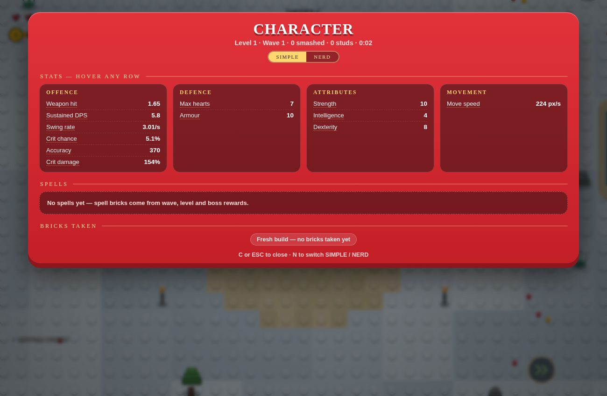

The hand-written blocks at the top carry the deep explanations. Underneath them,
**EVERY STAT** is generated straight from the probe list, grouped, with each row's
explanation on hover — so a probe added for the comparison reaches this screen the same day
rather than months later. A test asserts every probe appears (in NERD, where this lives).

### The spellbook — <kbd>P</kbd> — *what am I carrying?*

Every brick the run holds, drawn as the bench card it came from and **dealt into stacks**:
three of a brick is three cards fanned behind one another with a `×3` badge, and the text is
read off the **live hero**, so a brick taken at common and again at epic shows what the pair
of them are doing now. It is filed in the bench's own order, and a spell's section is headed
with that spell's live damage.

**Click a stack and it fans out.** The ghosts behind a deck tell you *how many* copies you
own but never *which* ones — and two copies of the same brick are rarely the same card,
because each was rolled at its own rarity. Opening one lays them out in the order they were
taken, each drawn at the rarity it actually came in at, with its own numbers. A stack of
three Fault Hammers opens into `+0.5`, `+3` and `+5`. Opening another deck closes the last;
clicking anywhere else closes them all. A brick handed over by a favourite's starting kit
has no pick behind it, so it says *starting kit* rather than inventing a tier.

**It pauses.** It was built not to, and that was simply wrong: reading nine sections of
cards while a wave-40 pack walks into you is not a choice anyone makes twice. It takes its
own state, so the world freezes and stays drawn behind it.

### The boss bar — *what is it carrying?*

The boss block stacks **under** the wave block now rather than being drawn through it: the
wave number, its modifier chips and the bodies-left line all live at the top of the screen,
and the boss's traits were being painted straight over them. One function reports where the
wave block ends, and the boss block starts below whatever it actually used.

Above the health bar, a **shield track** on the six bosses that carry one, with `RECHARGING`
written into its right end the moment the clock runs out — because that is the decision you are
making: a fight you cannot out-damage looks exactly like what it is. Everything above the health
bar moves up by the track's height when there is one, which is what stops `THE DREAD ROOST` being
printed straight through its own shield.

Under the health bar, **every debuff on the boss on one line**, left to right — poison,
bleed, burning, BURNT, chill, shock, frozen — as a **symbol and a count**, no names. On a
boss you are reading this mid-fight, and a row of words is not something you can read
mid-fight. The glyphs are drawn rather than typed: the game's font has no dingbats, and a
missing one renders as a tofu box.

### The bench's roster — <kbd>1</kbd><kbd>3</kbd><kbd>3</kbd><kbd>7</kbd>

The monster list was one flat wall of forty names that told you nothing about the shape of a
run. It is filed into **wave bands** — 1–5, 6–10, 11–15 and so on — with the golems and the
bosses in their own bands at the end, because golems are seeded into waves rather than
bought from the budget.

**Hover any of them** and the same panel the bricks use fills with what that body *is*: its
health, contact damage and armour **at the wave you are standing in**, its base numbers, its
move speed and attack interval, its elemental resistances, the wave it starts turning up in,
what it costs the wave budget, and what it pays out. The at-this-wave numbers run through
the same wave curve, monster level and difficulty the spawner uses, so they are what you
would actually meet rather than the table's raw base.

### Every number is the colour of what it is

**One palette, read everywhere a number is drawn.** White is plain physical, and every type
owns a colour of its own — so a converted hit wears the colour of what it *arrived* as, and
you can watch a conversion work without opening a menu and doing arithmetic.

| | | | |
|---|---|---|---|
| ⬜ **Physical** | `#ffffff` | 🟥 **Fire** | `#ff4a3c` |
| 🟦 **Cold** | `#6fb7ff` | 🟪 **Chaos** | `#b46aff` |
| 🟨 **Lightning** | `#ffe23d` | 🟩 **Lifesteal** | `#8ede4a` |

A wound keeps a dimmer relative of the type that opened it — **dark red** for a bleed,
**orange** for a burn, **dark green** for the rot — because a tick is a different *kind* of
event from a blow and reads better for being quieter.

**A critical is the same colour and simply bigger.** Gold for every critical told you it was
a critical and nothing else; what a hit is *made of* is the thing worth reading at a glance.

**A hit made of two things says two numbers.** Twenty per cent of your physical gained as
extra cold is a real part of every swing, and rolled into one figure in the colour of the
bigger half it was invisible everywhere but a chart in a panel — so a 137 swing with that
brick now reads `137` in white with `27.4` in blue stacked above it. Biggest first, each one
a little smaller than the one below. A part too small to read stays folded into the largest
rather than littering the screen, and whatever was folded in is *added back* to it, so the
figures on the screen always total the damage the monster actually took.

### The DPS tab — <kbd>L</kbd>, then the fourth tab

The run totals answer *"what did the most damage all run"*, which flatters whatever you
picked first and buries a spell that only came online at wave 30. The **DPS** tab answers
the balance question instead: what is each ability doing *right now*.

One bucket a second per damage source, sixty of them, rolled forward as the clock moves —
so a source that has gone quiet ages out of its own accord instead of sitting at its old
number for ever. Each row is the source, its rate over the window, a share bar against the
best one, its percentage, and a **sixty-second sparkline**. Bleed, burning and poison are
their own sources, so you can see exactly what an ailment build is really doing.

The window is only as long as the run has been going, or a spell picked up ten seconds ago
would read as a sixth of what it is actually doing; the header says `(filling)` until it has
a full minute. Every bucket index goes through one wrap helper: JavaScript's `%` keeps the
sign of its left operand, so a plain `x % 60` on anything negative indexes off the end of
the array and silently writes a *property* rather than a slot — a roll that looks like it
cleared thirty buckets and cleared two. Sources past the ninth fold into one `+N more` row rather than being dropped,
so the rows still add up to the total printed above.

### The TYPES tab — *what am I actually dealing?*

The same chart asked a different question. **DPS** says which of your spells is doing the
work; **TYPES** says what you are actually dealing — and the moment a conversion is in play
those stop being the same question. A staff running 45% fire-to-chaos shows one `fire`
source on the DPS tab and three rows on this one, because the fireball's chaos half also
leaves a dose behind.

Same buckets, same rolling minute, same sparklines. The two charts always total the same
damage; they are two readings of one number.

### Clearing it

**CLEAR**, in the panel's title row, wipes every tab, both sets of totals and all sixty
seconds of both charts. Half of reading a record is being able to start a fresh one: pull a
build together, wipe it, fight one wave and see what *that* wave did.

---

## Controls

| | |
|---|---|
| <kbd>W</kbd> <kbd>A</kbd> <kbd>S</kbd> <kbd>D</kbd> / arrows | move |
| **Left mouse** | swing — *hold* to whirl, once you own Blademaster |
| <kbd>Space</kbd> | roll — invulnerable through it, and a perfect dodge refunds bomb cooldown |
| <kbd>F</kbd> | start the next wave early — every wave opens with a breather (30s after a boss) |
| <kbd>F</kbd> *(held, mid-fight)* | call the next wave down on top of this one — 3 seconds' warning, up to 3 stacked, every wave pays its own reward |
| <kbd>C</kbd> | character sheet |
| <kbd>P</kbd> | **spellbook** — every brick you are carrying, dealt into stacks. **It does not pause the game** |
| <kbd>L</kbd> | combat log · <kbd>Shift</kbd>+<kbd>L</kbd> cycles dealt / taken / events / **DPS** / **TYPES** |
| <kbd>R</kbd> / <kbd>X</kbd> | on a reward screen: reroll · decline for studs |
| <kbd>Esc</kbd> | pause — or close the spellbook, if it is open |
| <kbd>M</kbd> | mute |

---

## Under the hood

Everything below is written by hand in one `<script>`, against a 2D canvas.

- **Bodies are capsules, not circles.** Every projectile, sweep, beam and blast tests
  against a segment running from the feet to the top of the head, so a bolt that crosses a
  chest connects with it.
- **A flow field for the chase.** Every monster is after the same hero, so one Dijkstra search
  runs outward from the hero's cell over a 40px grid (redone when the hero changes cell, about
  2ms) and every monster walks downhill, string-pulled to the farthest step still in sight. The
  sight line cannot slip between two blocked cells that touch at a corner, and a body-wide check
  stops it grazing a lake's edge. Small props are left to local steering — until something gets
  wedged on one, at which point the grid **learns** it for the rest of the run; a big rock that
  breaks is taken back off the grid. Local steering slides round what is in front, and a slide
  can no longer point a body back the way it came. A monster after a skeleton still asks for its
  own budgeted A\* path. On 40 random maps, one monster at a time from 500–950px, **640 of 640**
  reach the hero (the old per-monster A\* managed 495, and no knight ever closed in).
- **A uniform bucket grid** for every "what is near me" question — separation, sword
  swings, whirls, chain targeting — instead of scanning the whole roster.
- **View-frustum culling** at 1.25× the window for every draw pass.
- **Procedural audio.** Six tracks — `BRICKFIELD MARCH`, `QUARRY STOMP`, `CRYSTAL CAVERN`,
  `STUD OVERDRIVE`, `THE BRICK TYRANT`, `COLOSSUS RISING` — are sequenced live from Web
  Audio oscillators. There are no sound files. Cues run through a compressor on the master
  bus and a low-pass lid on the effects bus, with per-cue throttling so forty monsters
  arriving is one sound.
- **Seven biomes** — the Greenwood, the Dust Flats, the Grey Reach, the Mire, the White
  Waste, the Cinder Fields, the Long Meadow — each with its own props, palette and lakes,
  generated per run. Lakes are laid **on the stud grid**, whole cells only, so every stud in the
  water sits exactly over a stud of the floor and none is cut by the rim; the rim is a plate a
  cell, a 1×1 on every corner, and some lakes are two plates — an L, a T, a pond with a bay. How
  wet a run is rolls too. **Ruins** stand where they fall: rings of pillars with a gap or two to
  walk in by, colonnades you have to go round, heaps of boulders — some pillars snapped to a
  stump — so no two runs route the same way.

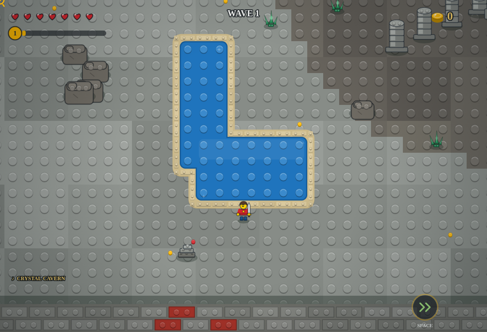
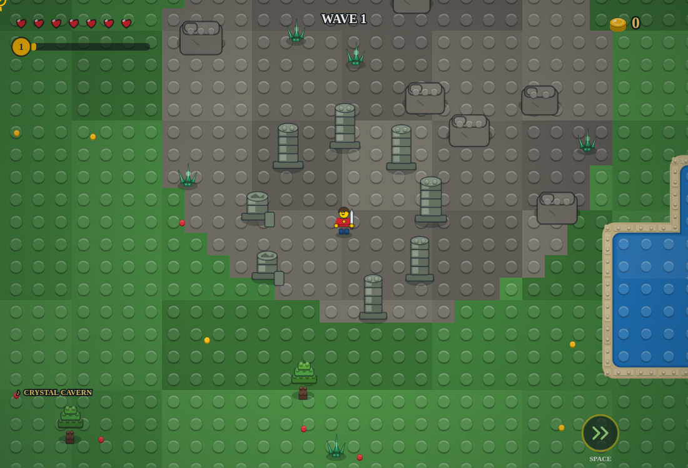

<details>
<summary><b>Developer note — the test bench</b> (mild spoiler)</summary>

<br>

Type <kbd>1</kbd><kbd>3</kbd><kbd>3</kbd><kbd>7</kbd> during play — in order, unbroken —
and a bench opens that grants any brick at any rarity, jumps to any wave, and switches
difficulty live. Each card opens at its **own lowest rarity**, which is what you want when
you are balancing: you see what it is worth when it actually drops. Hovering shows the full
now → next comparison; <kbd>Shift</kbd>+scroll walks the rarity up.

It also has a **sandbox**: switch it on and no wave ever arrives, then put any of the 37
monsters or 8 bosses in front of you on demand — <kbd>Shift</kbd>-click for an elite,
right-click for five.

It is how the numbers in this README were balanced, and it is deliberately not advertised
anywhere in the game.

</details>

---

<div align="center">

**Built brick by brick.** Everything — the renderer, the AI, the pathfinder, the damage
model, the music — is in [`lego-survival.html`](lego-survival.html).

*LEGO® is a trademark of the LEGO Group, which does not sponsor, authorise or endorse this
project.*

</div>
