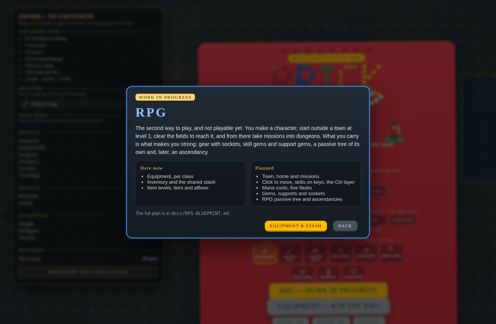

# RPG mode — blueprint

> **Status: work in progress, not playable.** This is the plan for BRICKBLADE's second game mode.
> What exists today is the mode switch on the title screen, a W.I.P. screen behind **START**, and
> the equipment, inventory and stash moved behind it. Nothing below is built yet unless it says
> **exists**.



---

## Contents

1. [Two modes, one game](#1-two-modes-one-game)
2. [The shape of the RPG](#2-the-shape-of-the-rpg)
3. [Character and class](#3-character-and-class)
4. [The world: fields, town, missions](#4-the-world-fields-town-missions)
5. [Controls and the skill bar](#5-controls-and-the-skill-bar)
6. [Mana and skill costs](#6-mana-and-skill-costs)
7. [Flasks](#7-flasks)
8. [Skill gems, support gems and sockets](#8-skill-gems-support-gems-and-sockets)
9. [Gear](#9-gear)
10. [The RPG passive tree](#10-the-rpg-passive-tree)
11. [Ascendancy classes](#11-ascendancy-classes)
12. [Death, saving and the stash](#12-death-saving-and-the-stash)
13. [What carries over from arcade](#13-what-carries-over-from-arcade)
14. [How it fits in the code](#14-how-it-fits-in-the-code)
15. [Roadmap](#15-roadmap)
16. [Open questions](#16-open-questions)

---

## 1. Two modes, one game

| | **ARCADE** | **RPG** (W.I.P.) |
|---|---|---|
| Start | difficulty → weapon → favourite skill → wave 1 | a character, level 1, outside town |
| Power comes from | upgrade cards + the arcade skill tree | **gear + skill gems + support gems + the RPG tree** |
| Levels feed | the arcade tree | the RPG tree |
| Upgrade cards | yes | **no** |
| Equipment, inventory, stash | **no** — a run is bricks | yes |
| Mana | a pool that nothing spends yet | every skill costs it |
| Flasks | no | five |
| Map | one arena, fifty waves | fields, a town, dungeons |
| Bosses and leagues | every five waves; breach, abyss, ritual, strongboxes | inside dungeons and zones |
| Movement | WASD | click to move |

**Exists:** the title's mode row (ARCADE / RPG · W.I.P.), remembered between visits; in ARCADE,
no gear is worn, dropped, sold by the ritual, carried in a run link, or reachable with <kbd>I</kbd>
or a button — the gear code is all still there, asked through `modeHasGear()`. In RPG, **START**
opens the W.I.P. screen, whose **EQUIPMENT & STASH** button opens the equipment screen and comes
back to it.

## 2. The shape of the RPG

```
 create a character ─▶ THE OUTSKIRTS (lv 1–4) ─▶ TOWN ─┬─▶ missions ─▶ dungeons ─┐
                                                       │                         │
                                                       └──── stash · home ◀──────┘
```

1. You make a character: a name and a class.
2. You wake up **outside town**, level 1, with a starter weapon and one skill gem.
3. The **starting zone** is a short, hand-shaped field: a few packs, a mini-boss at the gate,
   a waypoint. It teaches click-to-move, the skill bar, mana and the first flask.
4. **Town** is safe: your **home** (the stash lives there), a **mission board**, a vendor,
   the waypoint.
5. **Missions** send you out: *run this dungeon*, *clear this zone*, *kill this boss*, *close
   this breach*. Each is an instance with a level; clearing it pays XP, loot and a reward.
6. You come back, sort the loot, socket new gems, spend points, take the next mission.

## 3. Character and class

A class is a **starting point on the RPG tree and a starting attribute spread** — not a weapon
lock. Any class can pick up any weapon; what it can *use well* is set by attribute
requirements and the gems it socketed. The six arcade weapons become the starter weapons.

Placeholder names, one per attribute corner, like Path of Exile:

| Class | Attributes | Starts with | Arcade weapon it echoes |
|---|---|---|---|
| **Bruiser** | STR | mace, a slam gem | mace |
| **Scout** | DEX | bow, a shot gem | bow |
| **Tinkerer** | INT | staff, a bolt gem | staff |
| **Knight** | STR / DEX | sword, a strike gem | sword |
| **Warden** | STR / INT | sceptre, a minion gem | scepter |
| **Raider** | DEX / INT | axe, a spinning gem | axe |
| **Minifig** | all three, centre of the tree | any, unlocked later | — |

- **Exists:** STR, DEX and INT and what they give; six weapon classes with their own feel;
  per-weapon equipment sets (these become **per-character**, see §12).

## 4. The world: fields, town, missions

- **Zones replace waves.** A zone is a map with packs already placed (the arena's pack spawner
  and monster levels are reused), rare and magic monsters, a mini-boss, props and chests.
  Monster level is the zone's level, not the wave number (`mobRank()` becomes a zone property).
- **The Outskirts** (level 1–4): the tutorial field outside the gate.
- **Town** (no combat): home with the stash, the mission board, a vendor (sells flasks and
  low gems, buys items for studs), a waypoint.
- **Missions** from the board: a dungeon (a few rooms, a boss), a zone clear, a named boss,
  a league encounter. Each has a level band and a reward (XP, a chest, a gem, studs).
- **Leagues come along.** Breach, abyss, ritual and strongboxes already work as encounters;
  in RPG they appear inside zones and dungeons instead of on waves (and can be a mission
  modifier: *"this dungeon has a breach"*).
- **Later:** an endgame of item-like **maps** that roll their own level and modifiers — the
  arcade's wave modifiers are the start of that list.

## 5. Controls and the skill bar

Path of Exile's layout. Movement is **click to move**; <kbd>Left mouse</kbd> is also the basic
attack when it lands on a monster.

| Key | Default |
|---|---|
| <kbd>Left mouse</kbd> | move / basic attack (a skill slot — it can hold any skill) |
| <kbd>Right mouse</kbd> | skill |
| <kbd>Middle mouse</kbd> | skill |
| <kbd>Q</kbd> <kbd>W</kbd> <kbd>E</kbd> <kbd>R</kbd> <kbd>T</kbd> <kbd>Y</kbd> | skills |
| <kbd>1</kbd> <kbd>2</kbd> <kbd>3</kbd> <kbd>4</kbd> <kbd>5</kbd> | **flasks** (see the conflict below) |
| <kbd>Ctrl</kbd> + <kbd>Q</kbd>…<kbd>Y</kbd> | six more skill slots |
| <kbd>Ctrl</kbd> + <kbd>1</kbd>…<kbd>5</kbd> | five more skill slots |
| <kbd>Space</kbd> | dodge roll (the arcade dash) |
| <kbd>I</kbd> · <kbd>C</kbd> · <kbd>P</kbd> | inventory · character · passive tree |
| <kbd>Esc</kbd> | menu |

**The Ctrl layer.** Holding <kbd>Ctrl</kbd> swaps the bar: the Q–Y row shows its Ctrl slots and
the keys fire those, exactly like Path of Exile. Release it and the normal slots come back.
Flasks have no Ctrl layer — there are five and only five.

> ⚠️ **A conflict to settle.** The request lists <kbd>1</kbd>–<kbd>5</kbd> as both skill slots
> *and* flask keys. They cannot be both. **Recommendation:** flasks own <kbd>1</kbd>–<kbd>5</kbd>
> (as in PoE), and skills live on the mouse, <kbd>Q</kbd>–<kbd>Y</kbd> and the whole Ctrl layer
> including <kbd>Ctrl</kbd>+<kbd>1</kbd>–<kbd>5</kbd>. That is **3 + 6 + 6 + 5 = 20 skill slots**
> and 5 flasks. Every key is rebindable from the options screen.

**Other clashes with arcade keys**, which RPG rebinds (arcade keeps its keys):

| Arcade key | Arcade use | In RPG |
|---|---|---|
| <kbd>W</kbd> <kbd>A</kbd> <kbd>S</kbd> <kbd>D</kbd> | move | <kbd>W</kbd>, <kbd>E</kbd>… are skills; movement is the mouse |
| <kbd>R</kbd> | reroll / open stashed rewards | a skill (no rewards to open) |
| <kbd>T</kbd> | the arcade tree | a skill; the RPG tree moves to <kbd>P</kbd> |
| <kbd>P</kbd> | the book | the tree; the book moves to <kbd>B</kbd> |
| <kbd>F</kbd> | start the wave / leave a held wave | interact (doors, NPCs, waypoints) |
| <kbd>U</kbd> | the ritual window | unchanged |
| <kbd>1</kbd>–<kbd>4</kbd> | pick a reward card | flasks |
| <kbd>Ctrl</kbd>-click | bag ↔ stash in the equipment screen | unchanged — the Ctrl layer only applies in the world |

## 6. Mana and skill costs

**Exists:** the mana pool — 40 + 4 per level + 1 per 2 INT, regenerating 1.75% a second, fed by
flat and increased mana and regen from the tree, drawn as the right-hand globe. Nothing spends it.

- Every skill gem has a **mana cost** that rises with the gem's level.
- **Support gems multiply the cost** of the skill they support (×1.2 to ×1.5 each), so a six-link
  is expensive — the reason to invest in mana, regen and the mana flask.
- **Reservation:** persistent skills (auras, golems, the minion legion) reserve a percentage of
  the pool instead of paying per cast. The golem cap and the legion sizes already exist.
- Not enough mana, the skill does not fire and the globe flashes. `spendMana()` exists.

## 7. Flasks

Five slots on <kbd>1</kbd>–<kbd>5</kbd>. Flasks hold **charges**, refill from kills (more from
rare and unique monsters) and refill fully in town.

| Flask | Effect |
|---|---|
| **Life** | restores life over a few seconds |
| **Mana** | restores mana over a few seconds |
| **Speed** (quicksilver) | move speed for a few seconds |
| **Resistance** | fire, cold or lightning resistance (one element per flask base) |
| **Utility** (the fifth slot is free) | armour, evasion, or a second life flask |

Flasks are items: they drop, have item levels and can roll a prefix and a suffix
(*"of Heat"* removes burning, *"Seething"* works instantly). The item model already covers that.

## 8. Skill gems, support gems and sockets

**This is where the damage comes from.**

- **Skill gems** are items. Socket one into gear and you have that skill; put it on a key.
  A gem levels up with XP you earn while it is socketed, and has quality.
- **Support gems** do nothing alone; **linked** to a skill gem they change it: *more projectiles*,
  *pierce*, *fork*, *chain*, *added fire*, *faster casting*, *more area*, *minion damage*…
- **Colours:** red (STR), green (DEX), blue (INT). A gem fits a socket of its colour; its
  attribute requirement grows with its level.
- **Sockets and links** are rolled on gear: body armour and two-handed weapons up to 6,
  helmet, gloves and boots up to 4, one-handed weapons and shields up to 3, amulet and rings
  one unlinked socket each (open question — PoE has none there).

**Almost everything already exists as a brick** — the RPG gives it a new home:

| Arcade today | RPG |
|---|---|
| Spell bricks: Chain Lightning, Storm Brick, Bomb Volley, Blade Vortex, Bladestorm, Orbit, Aegis Ring, Twin Ring, Raise Zombie, the golems, the bone legion… | **skill gems** |
| Weapon swings, the slam, reaving, the bow's arrow | **attack skill gems** (the basic attack stays gem-free) |
| Pierce, split arrow, fork, chain, ricochet, more AoE, conversion, ailment chance, faster casting | **support gems** |
| Rarity tiers on a brick (common → legendary) | gem **level and quality** |
| Favourite skill | the class's starting gem |

## 9. Gear

**Exists:** Path of Exile's item model, kept small — bases per slot, implicits, magic and rare
affixes, T1–T10 affix tiers by item level, boss-only drops at the monster's level, the bag and
the shared stash, one gear set per hero, tooltips with the change against what you wear.

To add for RPG:

- **Sockets and links** on every item (§8), shown on the paper doll and the tooltip.
- **Drops from everything**, not only bosses, at rates tuned for a zone rather than a wave.
- **Attribute requirements** on bases and gems.
- **Uniques** (hand-made items) and, later, simple currency: a reroll, a socket reroll,
  a link reroll, an upgrade from magic to rare.
- **Vendor** sells and buys for studs.

## 10. The RPG passive tree

A second tree, separate from the arcade tree, **one point per level** (plus a few from missions).

- Built with the same renderer, lattice, clusters and highways the arcade tree uses — only the
  node set is new. The seven classes start at seven places on it; Minifig in the middle.
- Small nodes: attributes, life, mana, damage by type, defences.
- Notables and keystones: the arcade's keystones (Chaos Inoculation, the ES ones, Ricochet,
  the three-types keystone…) are the starting list.
- Respec with a currency or studs, not free — the arcade tree's presets are a nice-to-have later.

## 11. Ascendancy classes

Each class gets **three ascendancies** (Minifig gets one that borrows from the others), chosen once after the first
**trial** (a mission). A small tree of its own, **8 points** earned from trials.

Placeholder examples, to show the flavour:

| Class | Ascendancies |
|---|---|
| Bruiser | **Wrecker** (slams, aftershocks) · **Juggernaut** (armour, endurance charges) · **Chieftain** (fire, totems) |
| Scout | **Deadeye** (projectiles, ricochet) · **Pathfinder** (flasks) · **Skirmisher** (speed, frenzy charges) |
| Tinkerer | **Stormcaller** (lightning, shock) · **Elementalist** (golems, exposure) · **Occultist** (chaos, curses, ES) |
| Knight | **Champion** (banners, fortify) · **Gladiator** (block, bleed) · **Slayer** (leech, overkill) |
| Warden | **Necromancer** (minions, corpses) · **Guardian** (auras, reservation) · **Hierophant** (brands, mana) |
| Raider | **Assassin** (crit, poison) · **Saboteur** (traps, mines) · **Trickster** (evasion, ES) |

## 12. Death, saving and the stash

- **Characters** are save slots in `localStorage` (name, class, level, XP, tree, ascendancy,
  gear, gems, flasks, zone, missions done). Several characters per browser.
- **The stash is account-wide** (every character on this browser) — it already is shared today.
- **Equipment becomes per-character**, replacing today's six per-weapon sets. A migration moves
  each weapon set into the stash on first load, so nothing is lost.
- **Death** sends you back to town and costs a slice of the XP into the level (PoE's penalty),
  from level 10 on. The instance is lost; the gear is not.
- Later: an optional hardcore flag.

## 13. What carries over from arcade

**Taken over as they are:** the damage model (flat, increased, more, conversion, crit,
accuracy/evasion, armour, resistances, ailments, curses), life, energy shield, mana and the
globes, the monster roster and its levels, packs and modifiers, bosses and their traits, the
leagues, strongboxes, minions and golems, the item model, the stash, the options, the layered
sound, the combat log and the character sheet.

**Left behind:** upgrade cards and their rarity roll, the reroll, favourites (a starting gem
instead), the arcade tree, the fifty-wave structure, difficulty as a menu choice (zone level
does that job), the run link (a save slot does).

## 14. How it fits in the code

Still one HTML file. The split is a flag, not a fork:

- `GAME_MODE` (`'arcade' | 'rpg'`) and `modeHasGear()` **exist**. Every RPG-only system asks
  the mode; arcade stays byte-for-byte what it is.
- **A world layer**: `zone` (map, level, packs, exits) replaces `wave` for RPG; the arena map
  generator and the A* / flow-field pathing (which click-to-move needs) already exist.
- **An input layer**: an action map (`skill1…skill20`, `flask1…5`, `move`, `interact`) read from
  a rebindable table, with the Ctrl layer as a modifier. Arcade gets the same table with its
  current keys, so the options screen can rebind both.
- **Skills as data**: each brick that becomes a gem needs `{ tags, cost, cast time, cooldown,
  damage effectiveness }` beside its existing behaviour; supports are functions over that data.
- **Gems as items**: a new item class in the gear model; items get a `sockets` array
  (`[{ col, link, gem }]`).
- **Save slots**: the gear save (`gearSave`/`gearLoad`) grows into a character save.
- **Tests**: every system gets a scratch test and break-builds, as the arcade does.

## 15. Roadmap

| Phase | What | Playable after it? |
|---|---|---|
| **0 — done** | Mode switch, W.I.P. screen, gear moved out of arcade, mana pool, globes | no |
| **1 — walk around** | Character creation and save slots · the Outskirts and a static town · click to move · <kbd>Left mouse</kbd> attack · XP and levels · zone monsters | a slice: kill things, walk into town |
| **2 — the bar** | Input layer and rebinding · the skill bar with the Ctrl layer · the first skill gems (from existing bricks) · mana costs | yes, with a few skills |
| **3 — the build** | Sockets and links · support gems · gem levels and colours · attribute requirements | the core loop |
| **4 — flasks** | Five flask slots, charges, flask items | |
| **5 — the tree** | The RPG passive tree, seven starts | |
| **6 — missions** | Mission board · dungeons with bosses · leagues inside instances · vendor | the full loop |
| **7 — ascendancy** | Trials, 21 ascendancies, 8-point trees | |
| **8 — endgame** | Maps with levels and modifiers, uniques, currency | |

## 16. Open questions

1. **Keys 1–5:** flasks (recommended, as above) or skills? If skills, where do flasks go?
2. **Classes:** keep the seven attribute classes, or one class per arcade weapon?
3. **Basic attack:** a fixed weapon attack on <kbd>Left mouse</kbd>, or a slot like any other?
4. **Sockets on jewellery:** none (PoE) or one each?
5. **Death penalty:** XP loss from level 10, or none?
6. **Town:** one town for now, or a town per act?
7. **Equipment migration:** move today's six per-weapon sets into the stash (proposed), or
   turn each into a starter character?
8. **Arcade gear:** confirmed gone for good in arcade, or a later "arcade with gear" option?
